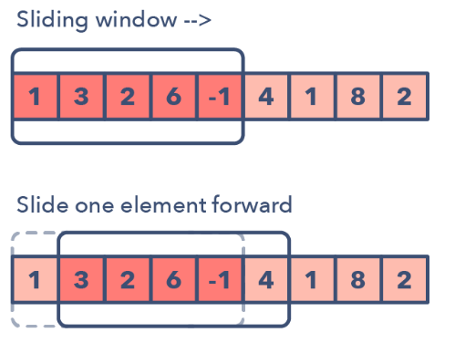

# Patterns of Solving Coding Interview Questions
Ref: https://medium.com/hackernoon/14-patterns-to-ace-any-coding-interview-question-c5bb3357f6ed

# Sliding Window
* Used to perform a required operation on a specific window size of a given array or linked list, such as finding the longest subarray containing all 1s.
* 

    ## Identification of pattern from problems
    * The problem input is a linear data structure such as a linked list, array, or string
    * You’re asked to find the longest/shortest substring, subarray, or a desired value

    ## Common problems
    * Maximum sum subarray of size ‘K’ (easy)
    * Longest substring with ‘K’ distinct characters (medium)
    * String anagrams (hard)

    ### Exceptions
    TODO

     

# 2 Pointers or Iterators
* Where two pointers iterate through the data structure in tandem until one or both of the pointers hit a certain condition.
* Useful when searching pairs in a sorted array or linked list; for example, when you have to compare each element of an array to its other elements.
* Two pointers are needed because with just pointer, you would have to continually loop back through the array to find the answer. This back and forth with a single iterator is inefficient for time and space complexity

    ## Identification of pattern from problems
    * It will feature problems where you deal with sorted arrays (or Linked Lists) and need to find a set of elements that fulfill certain constraints
    * The set of elements in the array is a pair, a triplet, or even a subarray

    ## Common Problems
    * Squaring a sorted array (easy)
    * Triplets that sum to zero (medium)
    * Comparing strings that contain backspaces (medium)
    * https://www.geeksforgeeks.org/two-pointers-technique/

    ## Illustration: Find all pairs in an array whose sum is k (array and k are given)
    1. Brute Force - O(n2)
    2. Optimization:
       1. Sort the array - O(nlogn)
       2. Take 2 pointers (Space - O(1)) - place one on the start of the arrary, and other at the end.
       3. Move pointers    
            1. if(p1 + p2) > k => move p2 to left (so as to decrease sum)
            2. if(p1+p2) == k => print the pair (for more pairs, move p1 to its right - this further depends on whether the array has unique elements or not - even if it has, we need pairs of values, not indices.)
            3. if(p1+ p2) < k => move p1 to right (so as to increase the sum)
            

     

# Fast and Slow Pointers or Iterators
* 
    ## Identification of pattern from problems

    ## Common Problems
     

## Merge Intervals
    ### Identification of pattern from problems

    ### Common Problems
     

## Cyclic sort
    ### Identification of pattern from problems

    ### Common Problems
     

## In-place reversal of linked list
    ### Identification of pattern from problems

    ### Common Problems
     

## Tree BFS
    ### Identification of pattern from problems

    ### Common Problems
     

## Tree DFS
    ### Identification of pattern from problems

    ### Common Problems
     

## Two heaps
    ### Identification of pattern from problems

    ### Common Problems
     

## Subsets
    ### Identification of pattern from problems

    ### Common Problems
     

## Modified binary search
    ### Identification of pattern from problems

    ### Common Problems
     

## Top K elements
    ### Identification of pattern from problems

    ### Common Problems
     

## K-way merge
   ### Identification of pattern from problems

    ### Common Problems
     

## Topological sort

    ### Identification of pattern from problems

    ### Common Problems