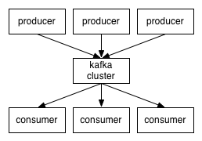
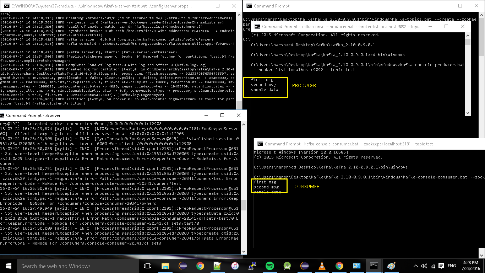

Apache Kafka

Ref: [Apache Kafka](https://docs.google.com/document/d/1cVYsT03sFD7ly-GyHJnoJoH5DbQJv8j7BNrNwEzQj74/edit?usp=drive_web)

- The connections are over TCP/IP protocol.
- The cluster is the set of  **brokers**  each in itself being a  **server.**

**Q: Can we have clusters across multiple machines? Cluster topology??**

- **Distribution:**
    - The partitions of the log are distributed over server in the Kafka cluster with
        - Each server handling data and requests for a share of the partitions.
    - Each partition is replicated across a configurable number of servers for fault tolerance.
    - Each partition
        - 1 Leader
        - >=0 Followers
    - Responsibilities:
        - Leader: handle read and write requests
        - Follower: passively replicated the Leader.
    - If the Leader fails, one of the followers replicates the leader
    - Each server acts as a leader for some of its partitions.

- **Producers**
    - Produce data to topics of their choice.
    - Responsible for choosing which message to assign to which partition of the topic.

- **Consumers**
    - Conceptually there are 2 messaging models:
        - Queuing
            - Consumers mays read message from the server and the message goes to one of them
        - Publisher-SUbscriber
            - Message is broadcasted to all

* * *

**Kafka offers a single consumer abstraction that generalizes both the queuing model and publisher subscriber model using CONSUMER GROUPS**.

- Consumers label themselves with the consumer name.
- Each message published to a topic is delivered to one consumer instance within each subscribing consumer group.

**Is all the consumer instances have the same consumer group - it depicts the traditional queuing model (and practically no parallelism), and in that case the load is balanced over all the consumers.**

A traditional queue retains messages in order, on the server and does hand out the messages to the consumers on demand. Since this happens asynchronously, the ordering is lost. A typical solution to which is to have a component (exclusive consumer) listen/read the messages from the server, and ensure serializability/ordering. In a way, there is no parallelism here.

Kafka does it better -  **PARTITIONS**.

It is with the help of partitions that ordering and parallelism both can be maintained

Each partition is assigned to a consumer in the consumer group => So each partition is consumed by exactly 1 consumer.

What happens here??

- Producers supplies the messages to a particular partition.
- The partition reads are tightly bound to one and only one consumer.
- **THERE CANNOT BE MORE CONSUMER INSTANCES IN A CONSUMER GROUP THAN A PARTITION.**

Kafka provides a total ordering within a partition only, not amongst the partitions within a topic.

- **Guarantees**
    - Messages produces for a partition are stored in order
    - A consumer instance sees the messages in the order that are stored in the log.
    - For a topic with replication factor N, we will tolerate up to N-1 server failures, without losing any messages committed to the log.

* * *

**WHEN TO USE WHICH TECH?? KAFKA, RABBITMQ etc…**

- Use  **Kafka**  - 100k+ events/second + ordering required per partition.
- Use  **RabbitMQ**  - 20k+ events/second that need to be routed in complex ways to consumers + Reliability -> is you want per message delivery guarantee + you don't care about ordering.
- RabbitMQ is broker centric - guarantees delivery.
- Kafka - Producer centric.
- **Kafka does not have MESSAGE ACKNOWLEDGEMENTS**.

* * *

**POC:**
https://dzone.com/articles/running-apache-kafka-on-windows-os

* * *

Notes from the talk from Nikhil Nanivadekar in Japan on June 5 2019

- https://www.youtube.com/watch?v=FW5bDVa_krA

**What is Apache Kafka?**

- In Kafka all the data and records are stored as a transaction log.(exactly like any DB transaction log)
    - In case your DB data becomes inconsistent - you play the transaction log to come to a sane state.
- The source of truth is always in the transaction log.
- Lets you decouple Producer and Consumer.
    - Each of them can do their job at their own rate.
- Retains order (since its a transaction log)
- There can be single producer and multiple consumers.

**Components of Kafka**

- **Zookeeper**: (to understand, visualise this as the Railway station in a train system)
    - **Single point of failure**
    - Coordinates the multiple Kafka brokers
    - Stores configuration for:
        - Topic
        - Producers
        - Consumers
    - Stores all the necessary metadata
- **Kafka Broker ( or Server)**
    - Stores your Kafka topics and retains your messages
- **Kafka Topic **(to understand, visualise this as the train lines)
    - Logical separation of messages.
- **Producer** (the train)
    - publishes (pushes) to a topic.
- **Consumer**
    - Consumes messages

* * *