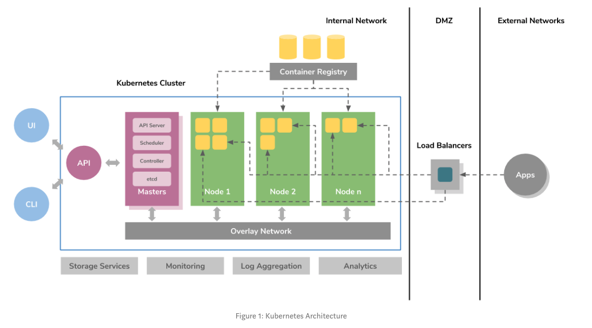

# Why kubernetes?
* It made the adaption of emerging software architectural patterns such as 
    * microservices, 
    * serverless functions, 
    * service mesh, 
    * event-driven applications 
      * much easier and paved the path towards the entire cloud native ecosystem.
* Its Cloud agnostic design made containerized applications to run on any platform without any changes to the application code.

# Kubernetes Architecture

* One of the fundamental design decisions which have been taken by this impeccable cluster manager is its **ability to deploy existing applications that run on VMs without any changes to the application code**.
    * application that runs on VMs can be deployed on Kubernetes by simply containerizing its components.
* Core features:
    * container grouping
    * container orchestration
    * overlay networking
    * container to container routing with layer 4 virtual IP based routing system
    * service discovery
    * support for running daemons
    * deploying stateful application components ability to extend the container orchestrator for supporting complex orchestration requirements.
* On a very high level, k8s prvides a set of *dynamically* scaable hosts for running workloads using containers and uses a set of **management hosts** called **masters** for providing an API for managing the entire container infrastructure.

# References
https://medium.com/containermind/a-beginners-guide-to-kubernetes-7e8ca56420b6