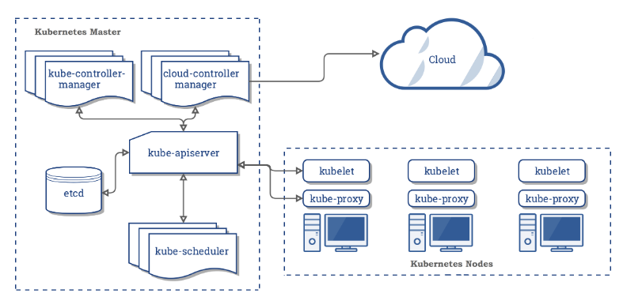
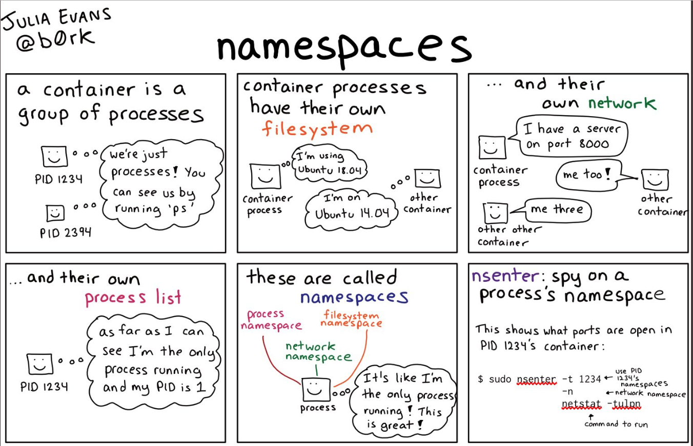
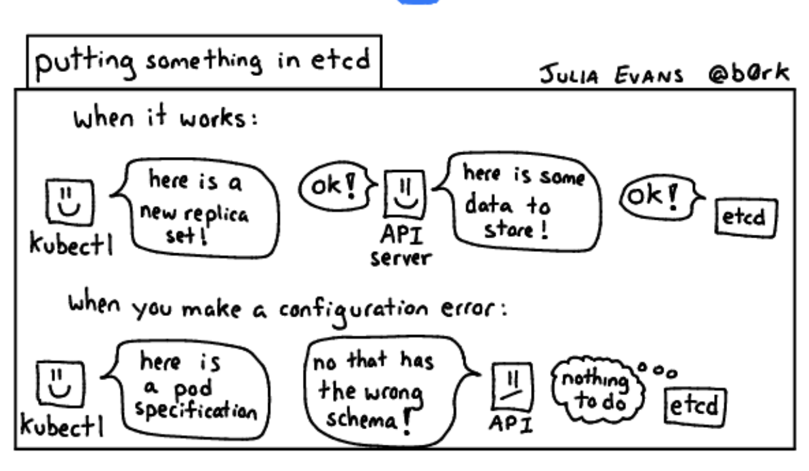
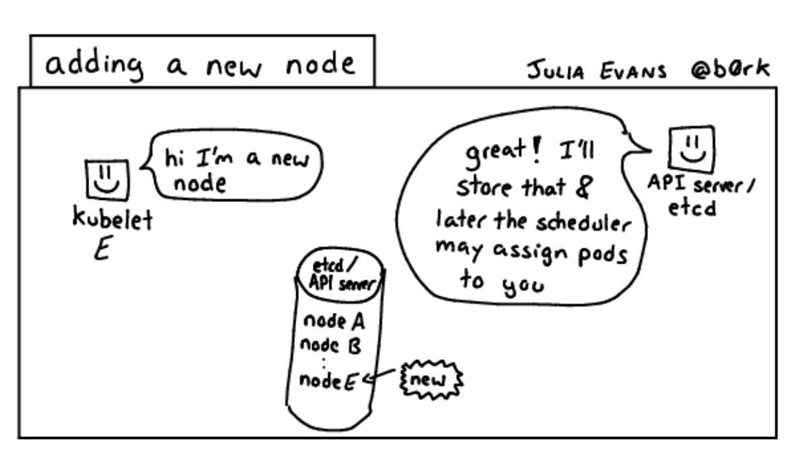
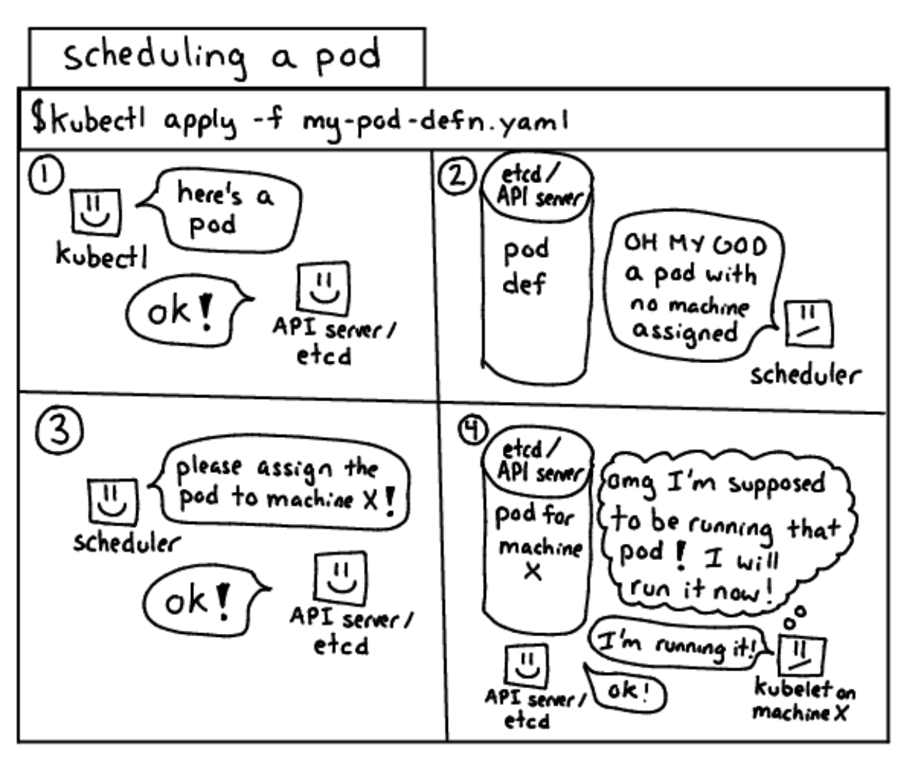
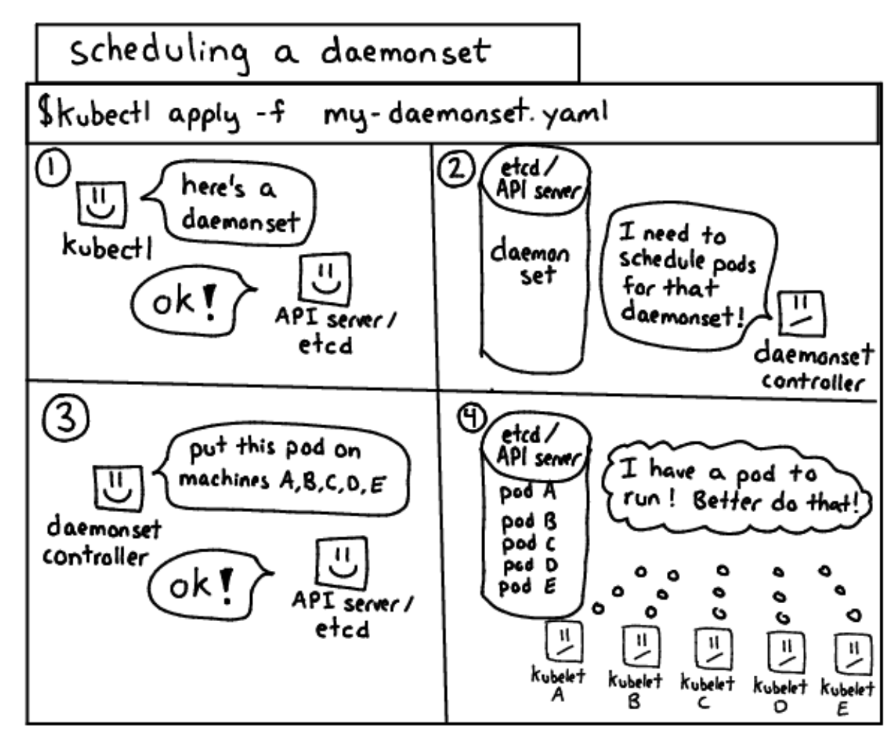
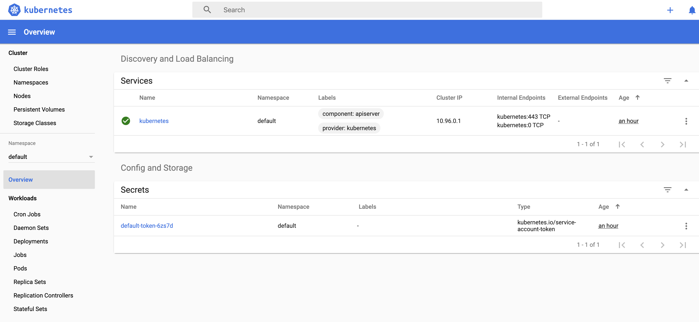

# Kubernetes Basics

# Kubernetes Components
> When you deploy Kubernetes, you get a cluster.
* **Cluster** = **set** of machines, called **nodes**, that run containerized application managed by Kubernetes
    * Cluster = >=1 worker node + >=1 master node
    * **Worker Node**: host the pods that are the components of the application.
    * **Master Node**: managers the worker nodes and the pods in the cluster.
        * Multiple master nodes are used to provide a cluster with failover and high availability.
* 


* ## Master components
  * #### kube-apiserver
  * #### etcd
  * #### kubescheduler
  * #### kube-controller-manager
  * #### cloud-controller-manager
* ## Node components
  * #### kubelet
  * #### kube-proxy
  * #### Container Runtime
  * ### Addons
* ### dns
  * #### Web UI
  * #### Container Resource Monitoring
  * #### Cluster-Level Logging

# Containers
* Ref: http://www.docker.com/resources/what-container
* Concepts of container as opposed to a VM 
    * Containers are designed as a packaging construct (app code + dependencies) to create a reproducible environment.
        * This helps remove the "it worked on my machine" problem of the past.
        * It was not original intended to be a security construct, although it can have security benefits.
    * A container is simply a running process on a host with additional sandboxing. Containers do nor run "on Docker", but **alongside** Docker as another process on a host.
        * Docker helps by talking to the operating system to configure what the process should look like.
    * Container processes have less isolation than an application running on virtual machine.
        * They share much more of the udnerlying operating system.
* ## Container image
    * Its isn't a single file, but rather a specification for  a manifest file that points to other files
    * They are constructed with a series of filesystem layers, where each layer inherits and modified the layers that came before it.
    * E.g.

            -- container A : a base OS only, such as Debian
                +----- container B : build upon #A, by adding Ruby v2.1.1
                        +---- container D : build upon #B, adding Rails v4.2.3
                        +-----container E : build upon #B, adding Rails v3.2.6
                +------container C: build upon #A, by adding Golang v1.6
                        
        * 5 containers - A,B,C,D & E
            * B & C are forked from A
                * share nothing besides the base contianer's files.
            * D & E forked from B
    * The container root filesyste, and configuration file are typically bundled using the Docker image format.


# Namespaces
* You can create individual namespaces to effectively seggregate users or applications.
* A namespace provides a user or application a view of the cluster as if they're the only application running.
* 

TODO: Look for Julia Evans zines for quick perusal of concepts.

# Service
* A service is a collection of pods.
* A service is a collection of pods, which each have their own IP address (like 10.1.0.3, 10.2.3.5, 10.3.5.6)
    * Every Kubernetes service gets an IP address (like 10.23.1.2)
    * `kube-dns` resolves Kubernetes service DNS names to IP addresses (so my-svc.my-namespace.svc.cluster.local might map to 10.23.1.2)
    * `kube-proxy` sets up iptables rules in order to do random load balancing between them. Kube-proxy also has a userspace round-robin load balancer but my impression is that they don’t recommend using it.

# Pod
- group of **one or more containers**
- tied together for the purpose of networking and administration.
- **By default, a pod is only accessible by its internal IP address within the kubernetes cluster**
    - **To make a container, say _hello-node_ container, accessible outside kubernetes cluster, the pod has to be exposed as a [kubernetes service](https://kubernetes.io/docs/concepts/services-networking/service/)**
  

# Docker
* The Docker image format is made up of a series of filesystem layers.
    * Each layer adds, modifies, deletes files from the preceding layer in the file system.


# **Kubernetes Deployment**
- checks on the health of your pod and restarts the Pod's container if it terminates.
- Deployments are the recommended way to manage the creation and scaling of pods

# Networking
* 3 crucial things
  * Avoiding networking outages in production is important
  * Operating netwrorking software is hard.
  * It is worth thinking critically about major changees to your netwroking infrastructure and the impact that will have on your reliability.
* ## Avoiding networking outages in production is important
  * Key points about operating netwroking infrastructure:
      * Networking software often **relies very heavily on the Linux kernel**. So in addition to configuring the software correctly you also need to make sure that a bunch of different _sysctls_ are set correctly, and a misconfigured sysctl can easily be the difference between “everything is 100% fine” and “everything is on fire”.
      * Networking requirements change over time (for example maybe you’re doing 5x more DNS lookups than you were last year! Maybe your DNS server suddenly started returning TCP DNS responses instead of UDP which is a totally different kernel workload!). This means software that was working fine before can suddenly start having issues.
      * To fix a production networking issues you often need a lot of expertise. (for example see this great [post by Sophie Haskins on debugging a kube-dns issue](http://blog.sophaskins.net/blog/misadventures-with-kube-dns/)) 
  * It seems important to:
      * Very rarely make major changes to the production networking infrastructure (because it’s super disruptive)
      * When you are making major changes, think really carefully about what the failure modes are for the new network architecture are
      * Have multiple people who are able to understand, understood your networking setup
* ## Kubernetes networking components
    * Your overlay network backend (like flannel/calico/weave net/romana)
        * Overlay Network:
          * The overlay network is responsible for setting up iptables rules to ensure that containers can make network requests outside Kubernetes.
    * `kube-dns` : resolves k8s service DNS names to IP addresses.
    * `kube-proxy` : sets up iptable rules in order to do random load balancing between them.
    * Ingress controllers/ load balancersThe `kubelet`
* Possible things that can go wrong:
  * `kube-dns` is misconfigured
  * `kube-proxy` dies and your iptable don't get updated.
  * Troubleshooting? TODO:
* If you are going to setup HTTP services you probably need all of these.

# Cluster Networking
* There are 4 distinct networking problems to address:
    * Highly-coupled container-to-container communications: this is solved by pods and localhost communications.
    * Pod-to-Pod communications: 
    * Pod-to-Service communications: this is covered by services.
    * External-to-Service communications: this is covered by services
* ## Kubernetes Network Model
    * Each Pod gets its own IP address.
    * 

------------------------------------------------------------------------------------------

# Zines - Julia Evans





------------------------------------------------------------------------------------------
# Hands on
- Use the kubectl create command to create a Deployment that manages a Pod. The Pod runs a Container based on the provided Docker image.
    - `kubectl create deployment hello-node --image=gcr.io/hello-minikube-zero-install/hello-node`
- ## View the Deployment:
    - `kubectl get deployments`
      - Output
        ```
        NAME                          READY   STATUS    RESTARTS   AGE
        hello-node-7676b5fb8d-rmh97   1/1     Running   0          6m7s
        ```
    
- ## View pods:
  - `kubectl get pods`
    - Output
        ```
        NAME                          READY   STATUS    RESTARTS   AGE
        hello-node-7676b5fb8d-rmh97   1/1     Running   0          8m22s
        ```

- ## View cluster events
  - `kubectl get events`
    - Output
        ```
        LAST SEEN   TYPE     REASON                    OBJECT                             MESSAGE
        <unknown>   Normal   Scheduled                 pod/hello-node-7676b5fb8d-rmh97    Successfully assigned default/hello-node-7676b5fb8d-rmh97 to minikube
        11m         Normal   Pulling                   pod/hello-node-7676b5fb8d-rmh97    Pulling image "gcr.io/hello-minikube-zero-install/hello-node"
        8m11s       Normal   Pulled                    pod/hello-node-7676b5fb8d-rmh97    Successfully pulled image "gcr.io/hello-minikube-zero-install/hello-node"
        8m10s       Normal   Created                   pod/hello-node-7676b5fb8d-rmh97    Created container hello-node
        8m10s       Normal   Started                   pod/hello-node-7676b5fb8d-rmh97    Started container hello-node
        11m         Normal   SuccessfulCreate          replicaset/hello-node-7676b5fb8d   Created pod: hello-node-7676b5fb8d-rmh97
        11m         Normal   ScalingReplicaSet         deployment/hello-node              Scaled up replica set hello-node-7676b5fb8d to 1
        37m         Normal   Starting                  node/minikube                      Starting kubelet.
        37m         Normal   NodeHasSufficientMemory   node/minikube                      Node minikube status is now: NodeHasSufficientMemory
        37m         Normal   NodeHasNoDiskPressure     node/minikube                      Node minikube status is now: NodeHasNoDiskPressure
        37m         Normal   NodeHasSufficientPID      node/minikube                      Node minikube status is now: NodeHasSufficientPID
        37m         Normal   NodeAllocatableEnforced   node/minikube                      Updated Node Allocatable limit across pods
        36m         Normal   RegisteredNode            node/minikube                      Node minikube event: Registered Node minikube in Controller
        36m         Normal   Starting                  node/minikube                      Starting kube-proxy.
        ```

- ## Create a service
    1. Expose the Pod to the public internet using the kubectl expose command:
        
            > kubectl expose deployment hello-node --type=LoadBalancer --port=8080

            Output:
            service/hello-node exposed

        The `--type=LoadBalancer` flag indicates that you want to **expose your Service outside of the cluster**.

    2. View the Services
   
        > kubectl get services

            Output:
            NAME         TYPE           CLUSTER-IP    EXTERNAL-IP   PORT(S)          AGE
            hello-node   LoadBalancer   10.96.69.90   <pending>     8080:31950/TCP   53s
            kubernetes   ClusterIP      10.96.0.1     <none>        443/TCP          50m

        **Note**: 
        On cloud providers that support load balancers, an external IP address would be provisioned to access the Service. On Minikube, the LoadBalancer type makes the Service accessible through the minikube service command.

        <br />

    3. On Minikube, the LoadBalancer type makes the Service accessible through the minikube service command. 
        > `minikube service hello-node`

        **Sample output**: 
        | NAMESPACE |    NAME    | TARGET PORT |             URL             |
        |-----------|------------|-------------|-----------------------------|
        | default   | hello-node |             | http://192.168.99.100:31950 |


- ## Cleanup
    
    > $ kubectl delete service hello-node

        service "hello-node" deleted

    > $ kubectl get services

        NAME         TYPE        CLUSTER-IP   EXTERNAL-IP   PORT(S)   AGE
        kubernetes   ClusterIP   10.96.0.1    <none>        443/TCP   76m
    
    > $ kubectl delete deployment hello-node
        
        deployment.apps "hello-node" deleted

    > $ kubectl get deployments
       
        No resources found.

- ## Kubernetes Dashboard
  
    > minkube dashboard

        🔌  Enabling dashboard ...
        🤔  Verifying dashboard health ...
        🚀  Launching proxy ...
        🤔  Verifying proxy health ...
        🎉  Opening http://127.0.0.1:61643/api/v1/namespaces/kubernetes-dashboard/services/http:kubernetes-dashboard:/proxy/ in your default browser...

    
----------------------------------------------------------------------------------------------------------------------
## Quick Commands

- To check **if virtualization is supported on the underlying machine**
  - `sysctl -a | grep -E --color 'machdep.cpu.features|VMX'` 
  - The output of above command **should be having** **VMX**


- **Install `minikube`**
  - Pre-requisites
    - Install `kubectl`
    - Install a Hypervisor {HyperKit or VirtualBox or VMWareFusion}
  - `brew cask install minikube`
    - ALternatively 
      - `curl -Lo minikube https://storage.googleapis.com/minikube/releases/latest/minikube-darwin-amd64 \
  && chmod +x minikube`
      - AND `sudo mv minikube /usr/local/bin`
  
- **Cleanup Local State**   
  - If you have previously installed minikube, and run: 
    - `minikube start`
    - **Output**:

            😄  minikube v1.4.0 on Darwin 10.14.5
            💿  Downloading VM boot image ...
                > minikube-v1.4.0.iso.sha256: 65 B / 65 B [--------------] 100.00% ? p/s 0s
                > minikube-v1.4.0.iso: 135.73 MiB / 135.73 MiB [] 100.00% 2.00 MiB p/s 1m8s
            🔥  Creating virtualbox VM (CPUs=2, Memory=2000MB, Disk=20000MB) ...
            🐳  Preparing Kubernetes v1.16.0 on Docker 18.09.9 ...
            💾  Downloading kubeadm v1.16.0
            💾  Downloading kubelet v1.16.0
            🚜  Pulling images ...
            🚀  Launching Kubernetes ...
            ⌛  Waiting for: apiserver proxy etcd scheduler controller dns
            🏄  Done! kubectl is now configured to use "minikube"                                               
  - And this command returns an error:
    - `machine does not exist`
    - You need to clear minikube’s local state:
      - `minikube delete`


----------------------------------------------------------------------------------------------------------------------
## References
- kubectl commands
  - https://kubernetes.io/docs/reference/kubectl/overview/


