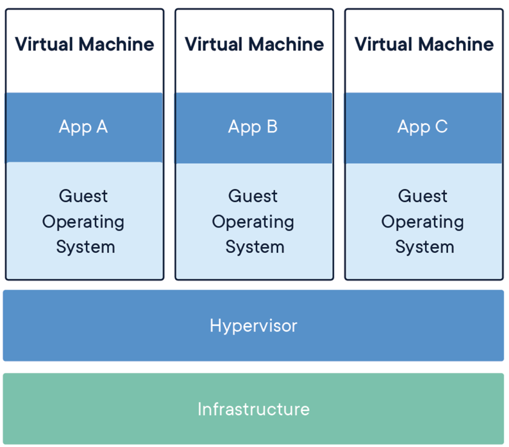
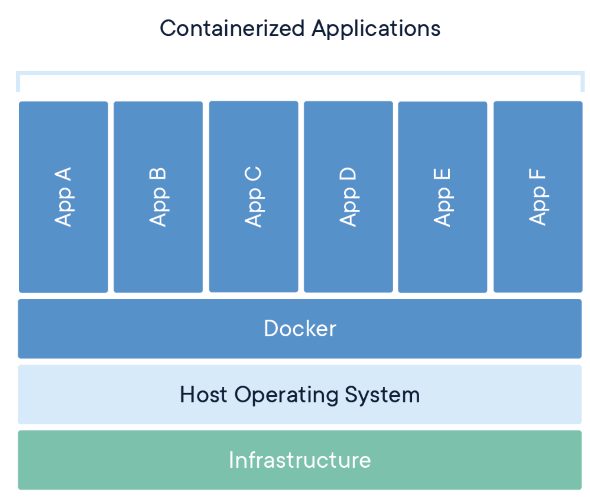

# VM vs container
* VM "virtualizes" the hardware
* Container "virtualizes" the OS
    * WHAT IS SHARED?
        * kernel, OS binaries etc.
        * CPU, Networking
    * WHAT IS NOT SHARED?
        * files and local to container resources.
* VMs
    * 
* Containers
    * 

# Difference between an Image and a Container
* **Image**: template(Dockerfile) that is used by Docker to create your running Container.
    * When Docker reads and executes the commands inside of your Dockerfile, the resul is an image that then can be run "inside a container"
* **Container**: -> a running image

# Docker and Kubernetes
* Kubernetes: orchestrator
    * manages multiple containers
* Docker: platform for building, shipping and running containers.
    * Docker, in and of itself, does not handle orchestration.

# Notes
* When working with containers, it is best practice to map one process to one container. Atleast follow -> "Keep It Simple Simon"
* When containers have one process, they can focus on doing one thing and one thing only.
    * This allows to scale up and down relatively easily.
* Conatainers are immutable and you should not wirte data into your container that you would like to be persisted after the container stops running.

# Docker Volumes
* TBD

# Tutorial
https://docker-curriculum.com/

# Hello-world
> docker run hello-world
1. The Docker client contacted the **Docker daemon**.
2. The Docker daemon pulled the "hello-world" image **from the Docker Hub**. (amd64)
3. The Docker daemon **created a new container** from that image which runs the executable that produces the output you are currently reading.
4. The Docker daemon **streamed that output to the Docker client**, which sent it to your terminal.

# To trigger ubuntu bash
> docker run -it ubuntu bash

# Fetch image from Docker Registry and save on local system - `pull` command
> docker pull busybox

# Note
* Running the run command with the -it flags attaches us to an interactive tty in the container. Now we can run as many commands in the container as we want.

# References
* Docker courses <https://dzone.com/articles/50-useful-docker-tutorials-for-it-professionals-fr>