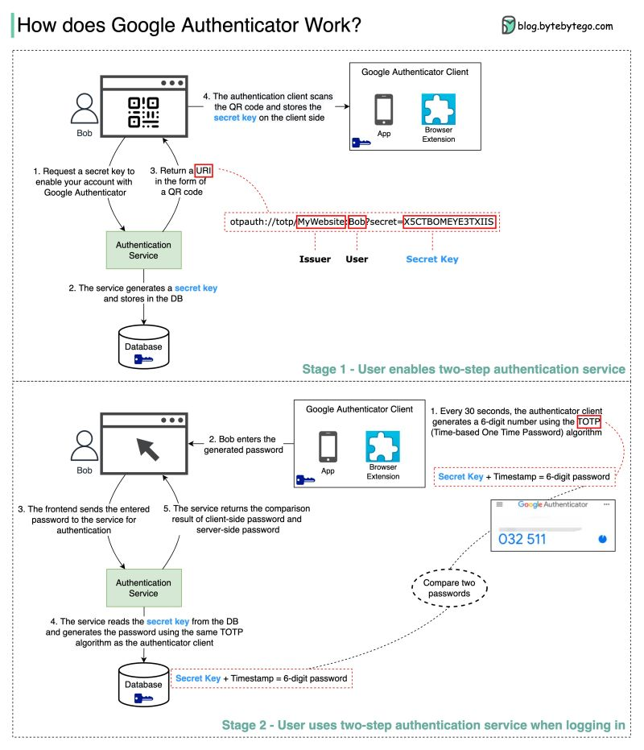

# How does Google Authenticator (or other types of 2-factor authenticators) work?
Ref: https://www.linkedin.com/posts/bytebytego_systemdesign-coding-interviewtips-activity-7077885585222164480-V-LN?utm_source=share&utm_medium=member_desktop

Google authenticator is commonly used for logging into our accounts when 2-factor authentication is enabled. How does it guarantee security?
 
Google Authenticator is a software-based authenticator that implements a two-step verification service. The diagram below provides detail.

There are two stages involved:

Stage 1 - The user enables Google two-step verification

Stage 2 - The user uses the authenticator for logging in, etc.

Let’s look at these stages.
 
𝐒𝐭𝐚𝐠𝐞 1
Steps 1 and 2: Bob opens the web page to enable two-step verification. The front end requests a secret key. The authentication service generates the secret key for Bob and stores it in the database.
 
Step 3: The authentication service returns a URI to the frontend. The URI is composed of a key issuer, username, and secret key. The URI is displayed in the form of a QR code on the web page.
 
Step 4: Bob then uses Google Authenticator to scan the generated QR code. The secret key is stored in the authenticator.

𝐒𝐭𝐚𝐠𝐞 2
Steps 1 and 2: Bob wants to log into a website with Google two-step verification. For this, he needs the password. Every 30 seconds, Google Authenticator generates a 6-digit password using the TOTP (Time-based One Time Password) algorithm. Bob uses the password to enter the website.
 
Steps 3 and 4: The frontend sends the password Bob enters to the backend for authentication. The authentication service reads the secret key from the database and generates a 6-digit password using the same TOTP algorithm as the client.
 
Step 5: The authentication service compares the two passwords generated by the client and the server, and returns the comparison result to the frontend. Bob can proceed with the login process only if the two passwords match.

Salient points:
* DB stores secret key per user - first time set, eventually get upon login
* the fetched secret key, upon enabling (for the first time, on the client device) is stored on the client side (storage - long term)
* the OTP is a function of the secret key and the timestamp - then (TOTP alog = time based on time password generation algo)

