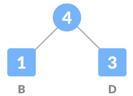
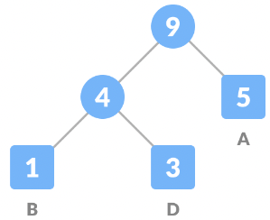
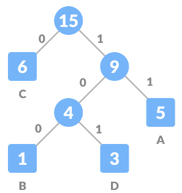

# Huffman Coding
* lossless compression
* helpful when there are frequently occuring chars in source data.

## How it works
suppose
BCAADDDCCACACAC -> 15 chars -> 8*15 = 120 bits

### Steps to Huffman coding
1. Calculate the count of occurrences of each character in the string
B 1
C 6
A 5
D 3
2. Sort the chars in increasing order of occurence
B 1
D 3
A 5
C 6
3. Now we mark every unique character as leaf node.
4. Lets create an empty node . Add characters having lowest count of occurence as the left child of n and second minimum count of occurence as the right child of n, then assign the sum of the above 2 minium frequencies to n

5. Remove these 2 min frequences from queue and append the sum into the list of frequencies
6. Add node n into the tree.
7. Just like we did for B and D, we repeat the same steps from 3 to 5 for rest of the characters (A and C)

Repeat for C

8. Now for generating codes for each character we traverse towards each leaf node representing some character from the root node and form code of it.
9. So
B 1 Code: 100 -> 3 bits
D 3 Code: 101 -> 9 bits
A 5 Code: 11 -> 10 bits
C 6 Code: 0  -> 6 bits
32 15          28 bits ==> total = 75 bits (instead of 120)

Basically, for Huffman encoding algo, 
* for every 1 we traverse towards the right child and
* for every 0 we traverse towards the left one

so for e.g. we need to decode 101 (which should decode to D).

- Characters in the input, will be leaf nodes
- each character will be encoded as 0s and 1s (given its a binary tree - max 2 children)

# Reference
https://www.topcoder.com/thrive/articles/huffman-coding-and-decoding-algorithm