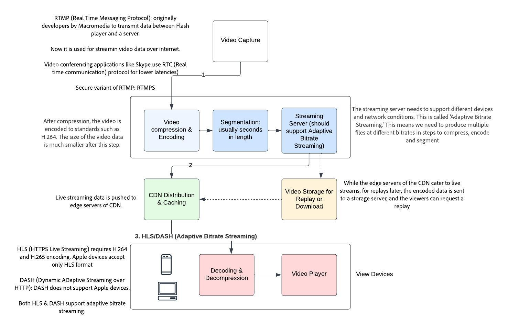

# Live Streaming
## Functional flow

## Facebook: How we scale Live streaming for millions of viewers simultaneously?
### Functional Rquirements
* To deliver a seamless streaming experience at this scale, the entire system, from ingest to delivery, needs to be reliable — but the overall system is only as reliable as its weakest component.
* Possible problems:
  * capacity limit somewhere in the network may degrade quality
  * a failure might cause a video stall or buffer for viewers
* Viewers should not experience interruptions like these on either social streaming or professional broadcasts.
* Millions of live streams daily.

### Technical Requirements
* Sophisticated ingestion capabilities to bridge the gap between traditional TV production and the internet based ingestion
  * Build redundancy at every point
    * transport
    * ingestion
    * processing
    * delivery
    * playback
* Scaled delivery infra to support streams with unprecedented viewership.

## Reliable ingestion

 
-> Coordinated failover
-> Delivery link capacity
-> Multiple geo distributed paths

## Massive delivery fanout

* WHen edge cache servers don't have the rquested content -> they forward the request to underlying services. This causes the Thundering Herd Problem

# Thundering Herd Problem
* Live stream - and millions connecting - so huge number of misses on the edge.
* Solution (approach): Add another layer of cache before the origin server (live streaming server). Pl note that the origin server can still receive requests, and was found to be 2% (which is still a large number when it comes to millions) in a study in FB. 
  * Further request coalescing can also be applied. (as for live, a very huge number of requests, might be requesting for the same video segment)

# Bringing Latency Down
* Live streams can contains 2 way communication -> broadcaster and consumer
* It is important to have near real time conversations without an awkward data transmission delay.
  * RTMP -> Real time messaging protocol

# Real Time Messaging Protocol
* streaming Protocol
* persistent TCP connection between player and the server during the whole broadcast
