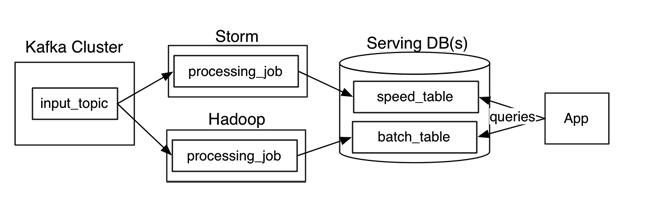
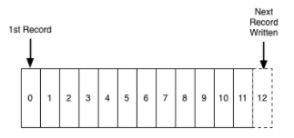
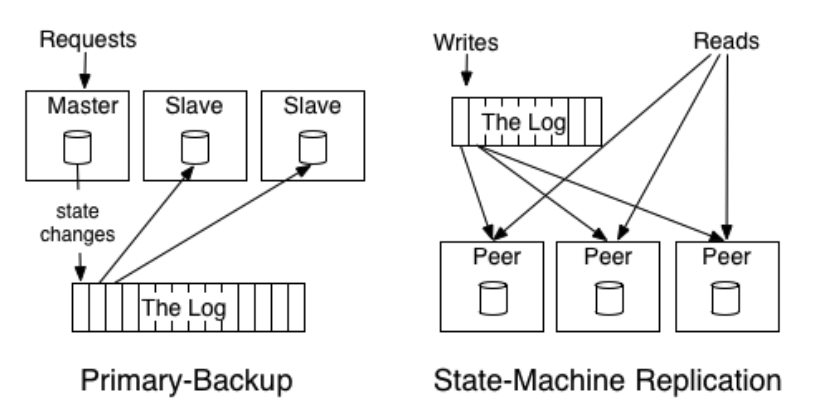

# Questioning the Lambda Architecture
* Ref: <https://www.oreilly.com/radar/questioning-the-lambda-architecture/>
* Ref: <https://engineering.linkedin.com/distributed-systems/log-what-every-software-engineer-should-know-about-real-time-datas-unifying>
    * The Log: What every software engineer should know about real-time data's unifying abstraction

# Lambda Architecture

* aimed at applications built around complex asynchronous transformations that need to run with low latency (say, a few seconds to a few hours)
* E.g. a news recommendation system that needs to crawl various news sources, process and normalize all the input, and then index, rank, and store it for serving

# Whats good about the Lambda Architecture?

# The Log: What every software engineer should know about real-time data's unifying abstraction
* Ref: <https://engineering.linkedin.com/distributed-systems/log-what-every-software-engineer-should-know-about-real-time-datas-unifying>
* At Linkedin, moving from monolithic, centralized database to a portfolio of specialized distributed systems
    * distributed graph database
    * distributed search backend
    * Hadoop installation
    * first and second generation key value store
* The most common thing amongst all these was **"The LOG"**.
* ## What is a log?
    * simplest possible storage abstraction.
    * append only - totally ordered sequence of events.
    * 
    * The log entry number can be thought of as the "timestamp" of the entry.
        * Generally it is expected to be decoupled from any other physical clock.
* **Logs are important and primary distinction of it with typical storage structures (tables/files etc) is <u>they record everything and when it happened</u>**
* ## 2 problems logs solve?
    * order
    * distribution
* ## State of a replica consuming from the log
    * One of the beautiful things about this approach is that the time stamps that index the log now act as the clock for the state of the replicas—you **can describe each replica by a single number, the timestamp for the maximum log entry it has processed**. This timestamp combined with the log uniquely captures the entire state of the replica.
* ## 2 broad approaches to distribution and replication
    * ### **State Machine Model**
        * usually refers to an **active-active model where we keep a log of the incoming requests and each replica processes each request**.
    * ### **Primary Backup Model**
        * is to elect one replica as the leader and allow this leader to process requests in the order they arrive and log out the changes to its state from processing the requests. The other replicas apply in order the state changes the leader makes so that they will be in sync and ready to take over as leader should the leader fail.
    * 
    * The distributed log can be seen as the data structure which models the problem of <u>**consensus**</u>.