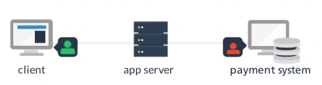
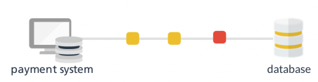
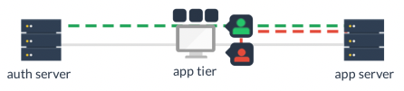

# STRIDE

## S - Spoofing (Authentication)
* Can an attacker impersonate another user against this component?
* It rfers to a hacker's desire to steal another user's identity for their malicious purposes
* 

## T - Tampering (Integrity)
* Can data be tampered with while it is in transit or in storage?
* Tamperin is a common way hackers will atack components.
* 

## R - Repudiation (Non-Repudiation)
* Is it possible that the hacker can dlete their own logs or attack the systems ability to trace what happened?
* Hackers will often delete traces of their involvement in the attack such as removing log events or bypassing logging.
* Would a hacker want to do this against a ceratin component?
  
## I - Information (Disclosure - Confidentiality)
* Can information be disclosed to unauthorized users?
* How is your system handling error conditions? If there a chcange that information could be disclosed if your web service does not fail secure?
* 

## D - DoS (Denial of Service, Availability)
* Will your software be a target for a denial of service? Does it make an attractive target such that hackers will tre to break down this component?
* DoS is an increasingly relevant attack on modern systems and if you service a high availability environment, this is a threat you may want to consider.

## E - Elevation of Privilege (Authorization)
* Would a hacker or malicioud user want to bypass authorization and attempt to elevate priviliges against this component?
* Components that manage authorization will be more susceptible to this attack if they are not well designed.
* 

# Standard controls
|Thread Type | Standard Controls|
|---|---|
| Spoofing | Cookie Authentication, PKI or SSO Infra| 
| Tampering | Input Validation, Digital Signatures SSL/TLS |
| Repudiation | Logging and auditing Policies |
| Information Disclosure | Encryption SSL/TLS Access Controls |
| Denial of Service |  Firewall/IPS/IDS, Request or IP Filtering |
| Elevation of Privilege | Access controls (RBAC), Input Validation, Separation of admin components |