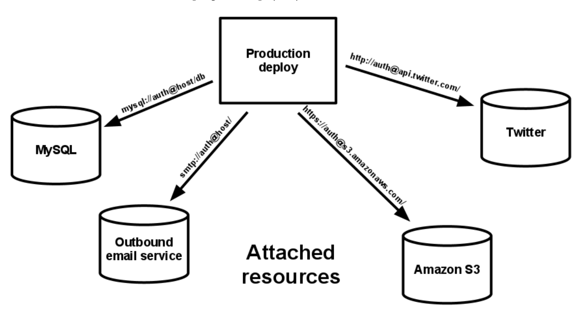
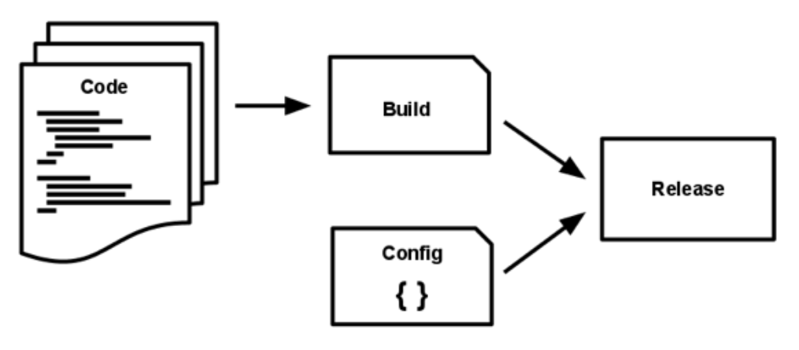
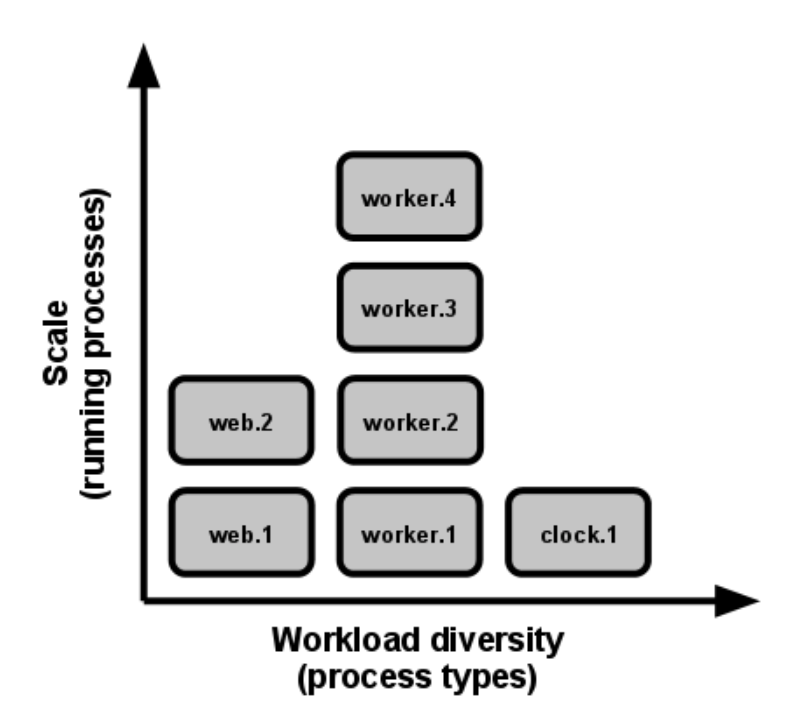
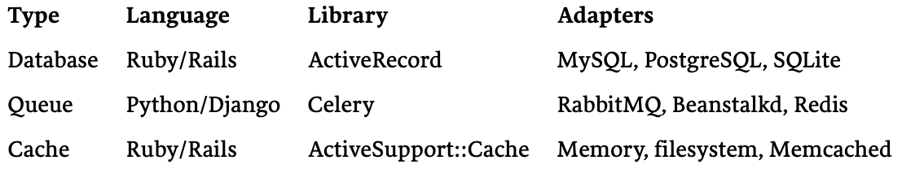

# 12 Factor App
Ref: https://12factor.net/

# Introduction
The twelve-factor app is a *methodology* for building *software-as-a-service apps* that:
  * Use **declarative formats for setup automation**, to minimize time and cost for new developers joining the project;
  * Have a clean contract with the underlying operating system, offering **maximum portability between execution environments**;
  * Are **suitable for deployment on modern cloud platforms**, obviating the need for servers and systems administration;
  * Minimize divergence between development and production, enabling **continuous deployment for maximum agility**;
  * And can **scale up without significant changes** to tooling, architecture, or development practices.

# 1. Codebase
* > One codebase, multiple deployments.
    * Deployments - {production, staging (multiple)}
* ## Recommendation on Codebase management
  * 1:1 correlation between codebase and app.
    * If their are mutiple code bases, its not an app - its a distributed system.
    * **Violation**: Muliple apps sharing the same codebase is a violation of the 12 factor app.
        * The solution here is to factor shared code into libraries which can be included through the dependency manager.

# 2. Dependencies
* > Explicitly declare and Isolate dependencies
* ## Recommendation on Dependency Management
  * A twelve-factor app **never relies on implicit existence of system-wide packages** (**Violation**). 
    * It **declares all dependencies, completely and exactly**, via a **dependency declaration manifest**.
* Furthermore, it uses a dependency isolation tool during execution to ensure that **no implicit dependencies** “leak in” from the surrounding system. 
    * The full and explicit dependency specification is applied uniformly to both production and development.
* **Benefit** of explicit dependency declaration is that it simplifies setup for developers new to the app.
* **Note**: If the app needs to shell out to a system tool, that tool should be vendored into the app.

# 3. Config
* > Store config in the environment
* An app’s config is everything that is likely to vary between deploys (staging, production, developer environments, etc). This includes:
    * Resource handles to the database, Memcached, and other backing services
    * Credentials to external services such as Amazon S3 or Twitter
    * Per-deploy values such as the canonical hostname for the deploy
  
* Apps sometimes **store config as constants in the code**. This is a **violation** of twelve-factor, which requires **strict separation of config from code**. 
    * Config varies substantially across deploys, code does not.
* A litmus test for whether an app has all config correctly factored out of the code is whether the codebase could be made open source at any moment, without compromising any credentials.
* This note applies to configurations that vary with deployments, essentially.
    * Does not apply on configurations like internal application configurations, containg routing information.
* ## Recommendation on config management
  * The 12 factor app stores config in environment variables
      * They are easy to change between deployments, without changing code.
      * There is a little chance of them being checked into code repo.
      * ?? So there has to be some repository - what if the whole environment is deleted. 

# 4. Backing services
* > Treat Backing services as attaches resources.
* ## What are backing services??
  * A backing service is any service the app consumes over the network as part of its normal operation. 
      * Examples include 
          * datastores (such as MySQL or CouchDB), 
          * messaging/queueing systems (such as RabbitMQ or Beanstalkd), 
          * SMTP services for outbound email (such as Postfix), and 
          * caching systems (such as Memcached).
* ## Recommendation on backing services
  * The code for a twelve-factor app makes no distinction between local and third party services.
      * To the app, both are attached resources, accessed via a URL or other locator/credentials stored in the config.
      * Expectations (examples) ~> **In these cases, only the resource handle in the config needs to change**:
          * A deploy of the twelve-factor app should be able to swap out a local MySQL database with one managed by a third party (such as Amazon RDS) without any changes to the app’s code.
          * A local SMTP server could be swapped with a third-party SMTP service (such as Postmark) without code changes.
  * Each distinct backing service is a **resource**.
  * The 12 factor app treats databases as attached resources.
  
      
  * Resources can be attached, detached from deploys at will.
      * For example, if the app’s database is misbehaving due to a hardware issue, the app’s administrator might spin up a new database server restored from a recent backup. The current production database could be detached, and the new database attached – all without any code changes.

# 5. Build, release, run
* > Strictly separate build and run stages.
* A *codebase* is transformed into a deploy, through 2 stages:
    1. **Build**
    2. **Release** 
    3. **Run**
* ## Recommendation on Build Release Run Process
  * The twelve-factor app uses strict separation between the build, release, and run stages. 
  
    
  * Deployment tools offer release management tools, most notably the ability to rollback to a previous release. Its `rollback` command makes it easy to quickly rollback to a previous release.
  * Every release should have a unique identified and a timestamp.
  * A release cannot be mutated once it is created.
      * A change can be accomodated in a _new_ release only.

# 6. Processes
* > Execute the app as one ore mote stateless processes.
* The app is executed in the execution environment as one or more processes.
* ## Recommendation on Process Management
    * 12 factor processes are **stateless** ad **share-nothing**.
    * Any data that needs to persist must be stored in a stateful backing service.
    * ?? Reservations??
        * What is storage writes/saves are discouraged?? (likely queueing system and leverage its infra (fundamentally) storage to store states)
    * The 12 factor app never assumes that anything caches in memory or on disk will be available on a future request or job - with many processes of each type running, chances are high that a future request will be a served by a different process.
    * A restart would wipe out all local (memory + filesystem) state.
    * Sticky sessions are a violation of 12 factor and should never be used or relied upon.
        * Session state data is a good candidate for a datastore that offers times expiration, e.g. Memcached or Redis.

# 7. Port Binding
* > Export services via port binding
* Web apps are sometimes executed inside a webserver container.
* ## Recommendation on port binding
  * The 12 factor app is completely self-contained and does not rely on runtime injection of a webserver into the xecution environment to create a web-facing service.
  * The web app exports HTTP as a service by binding to a port, and listening to requests coming in on that port.
  * In a local development environment, the developer visits a service URL like http: //localhost :5000/ to access the service exported by their app. In deployment, a routing layer handles routing requests from a public-facing hostname to the port-bound web processes.
  * This is typically implemented by using dependency declaration to add a webserver library to the app, such as Tornado for Python, Thin for Ruby, or Jetty for Java and other JVM-based languages. This happens entirely in user space, that is, within the app’s code. The contract with the execution environment is binding to a port to serve requests.
  * Note also that the port-binding approach means that one app can become the backing service for another app, by providing the URL to the backing app as a resource handle in the config for the consuming app.

# 8. Concurrency
* > Scale out via the process model.
* ## Recommendation on Concurrency
  * In the 12 factor app, processes are first class citizen.
  * Processes in the twelve-factor app take strong cues from [the unix process model for running service daemons](https://adam.herokuapp.com/past/2011/5/9/applying_the_unix_process_model_to_web_apps/).
  * Using this model, the developer can architect their app to handle diverse workloads by assigning each type of work to a process type. 
      * For example, HTTP requests may be handled by a web process, and long-running background tasks handled by a worker process.
  * The share-nothing, horizontally partitionable nature of twelve-factor app processes means that adding more concurrency is a simple and reliable operation. The array of process types and number of processes of each type is known as the process formation.
  
    

  * Twelve-factor app processes should never daemonize or write PID files.
      * Instead, rely on the operating system’s process manager (such as systemd, a distributed process manager on a cloud platform, or a tool like Foreman in development) to manage output streams, respond to crashed processes, and handle user-initiated restarts and shutdowns.

# 9. Disposability
* > Maximize robustness with fast startup and graceful shutdown
* ## Recommendation on Disposability
  * The twelve-factor app’s processes are disposable, meaning they can be started or stopped at a moment’s notice. 
      * This facilitates fast elastic scaling, rapid deployment of code or config changes, and robustness of production deploys.
  * Processes should strive to minimize startup time.
  * **Shut Down**: Processes shut down gracefully when they receive a SIGTERM signal from the process manager.
      * For a **web process**, graceful shutdown is achieved by ceasing to listen on the service port (thereby refusing any new requests), allowing any current requests to finish, and then exiting. Implicit in this model is that HTTP requests are short (no more than a few seconds), or in the case of long polling, the client should seamlessly attempt to reconnect when the connection is lost.
      * For a **worker process**, graceful shutdown is achieved by returning the current job to the work queue. For example, on RabbitMQ the worker can send a NACK; on Beanstalkd, the job is returned to the queue automatically whenever a worker disconnects. Lock-based systems such as Delayed Job need to be sure to release their lock on the job record. Implicit in this model is that all jobs are reentrant, which typically is achieved by wrapping the results in a transaction, or making the operation idempotent.
  * Processes should also be robust against **sudden death**, in the case of a failure in the underlying hardware.
      * While this is a much less common occurrence than a graceful shutdown with `SIGTERM`, it can still happen. A recommended approach is use of a robust queueing backend, such as Beanstalkd, that returns jobs to the queue when clients disconnect or time out. 
      * Either way, a twelve-factor app is architected to handle unexpected, non-graceful terminations. [Crash-only design](https://lwn.net/Articles/191059/) takes this concept to its [logical conclusion](http://docs.couchdb.org/en/latest/intro/overview.html). 

# 10. Dev/prod parity
* > Keep development, staging, and production as similar as possible
* ## Recommendation for Dev/prod parity
    * The twelve-factor app is designed for **continuous deployment** by keeping the **gap** between development and production **small**.
    * Possible measures:
        * Make the time gap small: a developer may write code and have it deployed hours or even just minutes later.
        * Make the personnel gap small: developers who wrote code are closely involved in deploying it and watching its behavior in production.
        * Make the tools gap small: keep development and production as similar as possible.
    * The twelve-factor developer **resists the urge to use different backing services between development and production**
        * Even when adapters theoretically abstract away any differences in backing services. Differences between backing services mean that tiny incompatibilities crop up, causing code that worked and passed tests in development or staging to fail in production. These types of errors create friction that disincentivizes continuous deployment. The cost of this friction and the subsequent dampening of continuous deployment is extremely high when considered in aggregate over the lifetime of an application.
* Backing services, such as the app’s database, queueing system, or cache, is one area where dev/prod parity is important. Many languages offer libraries which simplify access to the backing service, including adapters to different types of services. Some examples are in the table below.
  
    

# 11. Logs
* > Treat logs as event streams
* ## Recommendation on Logging/Logs
  * A twelve-factor app never concerns itself with routing or storage of its output stream. It should not attempt to write to or manage logfiles. 
  * Instead, each running process writes its event stream, unbuffered, to stdout. During local development, the developer will view this stream in the foreground of their terminal to observe the app’s behavior.
* Most significantly, the stream can be sent to a log indexing and analysis system such as Splunk, or a general-purpose data warehousing system such as Hadoop/Hive.
    * These systems allow for great power and flexibility for introspecting an app’s behavior over time, including:
        * Finding specific events in the past.
        * Large-scale graphing of trends (such as requests per minute).
        * Active alerting according to user-defined heuristics (such as an alert when the quantity of errors per minute exceeds a certain threshold).

# 12. Admin Processes
* > Run admin/management tasks as one-off processes
* The process formation is the array of processes that are used to do the app’s regular business (such as handling web requests) as it runs. Separately, developers will often wish to do one-off administrative or maintenance tasks for the app, such as:
    * Running database migrations (e.g. manage.py migrate in Django, rake db:migrate in Rails).
    * Running a console (also known as a REPL shell) to run arbitrary code or inspect the app’s models against the live database. Most languages provide a REPL by running the interpreter without any arguments (e.g. python or perl) or in some cases have a separate command (e.g. irb for Ruby, rails console for Rails).
    * Running one-time scripts committed into the app’s repo (e.g. php scripts/fix_bad_records.php).
* ## Recommendation on Admin Processes
    * Twelve-factor strongly favors languages which provide a REPL shell out of the box, and which make it easy to run one-off scripts. 
        * In a **local deploy**, developers invoke one-off admin processes by a direct shell command inside the app’s checkout directory. 
        * In a **production deploy**, developers can use ssh or other remote command execution mechanism provided by that deploy’s execution environment to run such a process.

