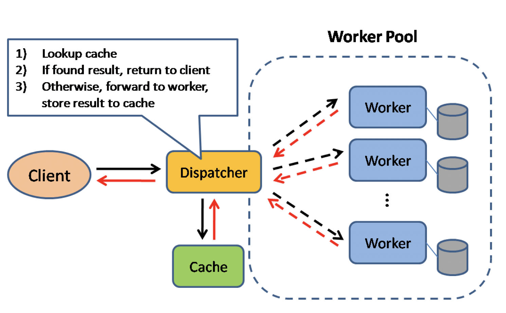
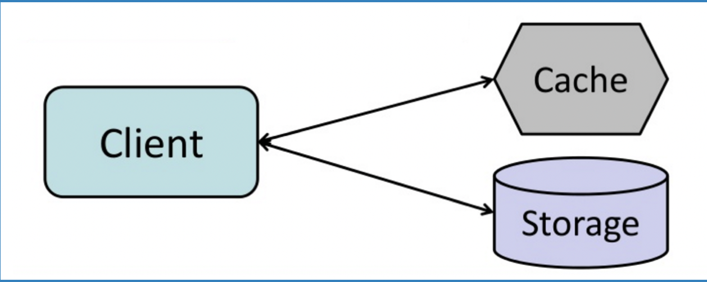
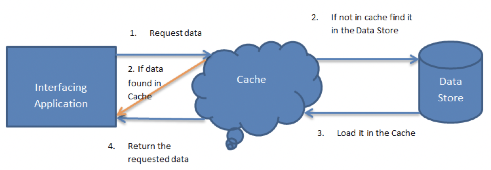
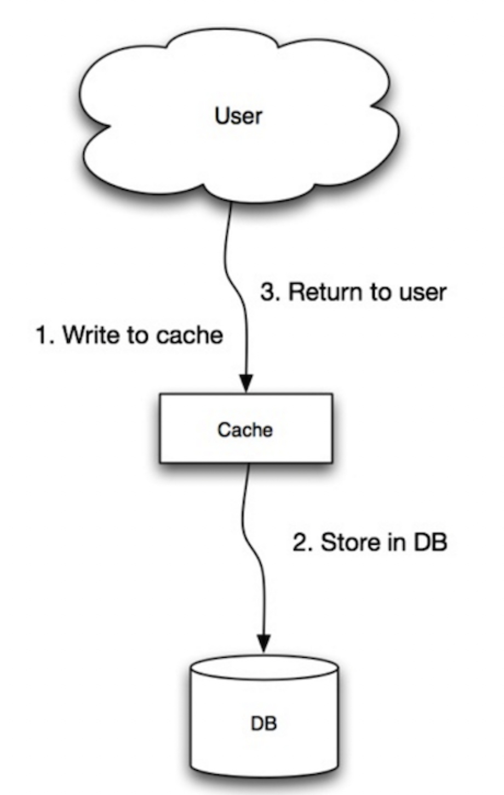
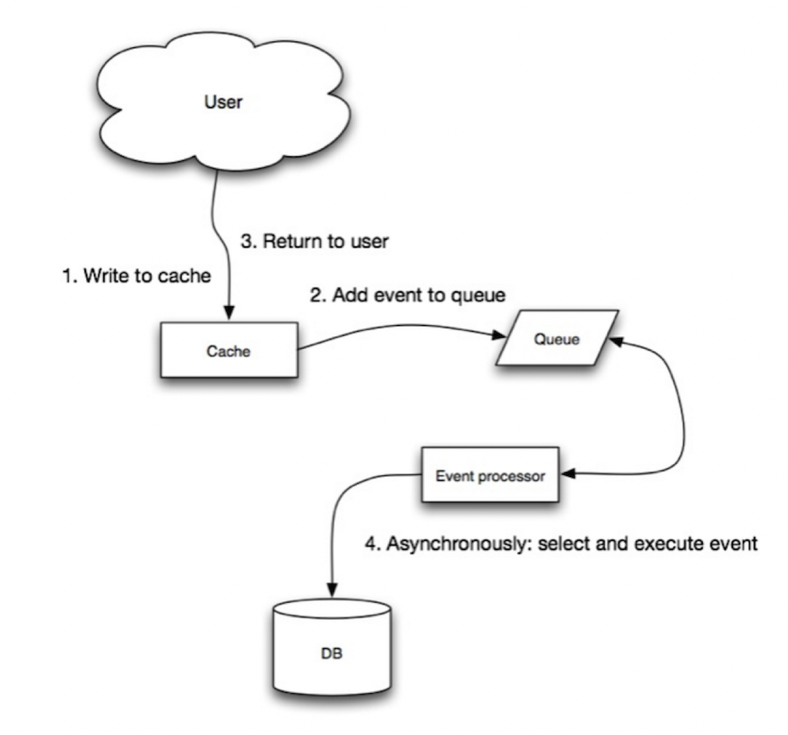
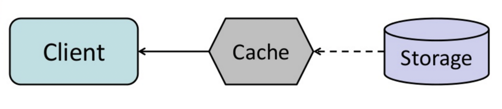

# Cache
----------------------------------------------------------------------------------------------------------------------

### Basics of Cache
Ref: https://github.com/donnemartin/system-design-primer#cache

##### Client caching
Caches can be located on the client side (OS or browser), server side, or in a distinct cache layer.

##### CDN caching
CDNs are considered a type of cache.

##### Web server caching
Reverse proxies and caches such as Varnish can serve static and dynamic content directly. Web servers can also cache requests, returning responses without having to contact application servers.

##### Database caching
Your database usually includes some level of caching in a default configuration, optimized for a generic use case. Tweaking these settings for specific usage patterns can further boost performance.

##### Application caching
In-memory caches such as Memcached and Redis are key-value stores between your application and your data storage. Since the data is held in RAM, it is much faster than typical databases where data is stored on disk. RAM is more limited than disk, so cache invalidation algorithms such as least recently used (LRU) can help invalidate 'cold' entries and keep 'hot' data in RAM.

Redis has the following additional features:
* Persistence option
* Built-in data structures such as sorted sets and lists

There are multiple levels you can cache that fall into two general categories: database queries and objects:
* Row level
* Query-level
* Fully-formed serializable objects
* Fully-rendered HTML

Generally, you should try to avoid file-based caching, as it makes cloning and auto-scaling more difficult.

----------------------------------------------------------------------------------------------------------------------

### Where to cache??
##### Caching at the database query level
Whenever you query the database, hash the query as a key and store the result to the cache. This approach suffers from expiration issues:
* Hard to delete a cached result with complex queries
* If one piece of data changes such as a table cell, you need to delete all cached queries that might include the changed cell

##### Caching at the object level
See your data as an object, similar to what you do with your application code. Have your application assemble the dataset from the database into a class instance or a data structure(s):
* Remove the object from cache if its underlying data has changed
* Allows for asynchronous processing: workers assemble objects by consuming the latest cached object

### What to cache??:
* User sessions
* Fully rendered web pages
* Activity streams
* User graph data

##### When to update the cache??
Since you can only store a limited amount of data in cache, you'll need to determine which cache update strategy works best for your use case.

----------------------------------------------------------------------------------------------------------------------

### Cache aside

_Source_: http://www.slideshare.net/tmatyashovsky/from-cache-to-in-memory-data-grid-introduction-to-hazelcast

The application is responsible for reading and writing from storage. The cache does not interact with storage directly. The application does the following:
* Look for entry in cache, resulting in a cache miss
* Load entry from the database
* Add entry to cache (EXPLICITLY done by the client) (before returning to the client)
* Return entry

    
    def get_user(self, user_id):
        user = cache.get("user.{0}", user_id)
        if user is None:
            user = db.query("SELECT * FROM users WHERE user_id = {0}", user_id)
            if user is not None:
                key = "user.{0}".format(user_id)
                cache.set(key, json.dumps(user))
    return user

> **Memcached** (https://memcached.org/) is generally used in this manner.

Subsequent reads of data added to cache are fast. Cache-aside is also referred to as lazy loading. Only requested data is cached, which avoids filling up the cache with data that isn't requested.
WHen cache aside is used, the most common write strategy is to write data in the database directly. Cache may become inconsistent, so developers use a TTL with data and continue serving stale data until TTL expires.

Use-cases
1. Work best for read heavy workloads.
    1. e.g. memcached, redis
2. Systems using cache-aside caches, are resilient to cache failures. (though response times will be worse due to DB hits)
3. 

**Pros**
    // TODO - Pros of Cache-aside TBD

**Disadvantage(s): cache-aside**
* Each cache miss results in three trips, which can cause a noticeable delay. CACHE MISSES ~ COSTLY.
* Data can become stale if it is updated in the database. This issue is mitigated by setting a time-to-live (TTL) which forces an update of the cache entry, or by using write-through.
* When a node fails, it is replaced by a new, empty node, increasing latency.

More details:
https://drive.google.com/open?id=16x1FSUxdOxNoayM7l2ojOfVPlT3R3ioq

----------------------------------------------------------------------------------------------------------------------

### Write-through

_Source_ : http://www.slideshare.net/jboner/scalability-availability-stability-patterns/

The application uses the cache as the main data store (ALL READ REQUESTS FIRST GO TO THE CACHE), reading and writing data to it, while the cache is responsible for reading and writing to the database (CACHE HAS THE INTELLIGENCE TO ADD/EVICT DATA):
* Application adds/updates entry in cache
* Cache synchronously writes entry to data store
* Return

**Application code**:
>set_user(12345, {"foo":"bar"})

**Cache code:**

    def set_user(user_id, values):
        user = db.query("UPDATE Users WHERE id = {0}", user_id, values)
        cache.set(user_id, user)

_**Write-through is a slow overall operation due to the write operation, but subsequent reads of just written data are fast. Users are generally more tolerant of latency when updating data than reading data. Data in the cache is not stale. (WHEN SLOW WRITES CAN BE AFFORDED, AS A COST FOR FASTER READS LATER)**_

**Disadvantage(s): write through**
* When a new node is created due to failure or scaling, the new node will not cache entries until the entry is updated in the database. Cache-aside in conjunction with write through can mitigate this issue.
* Most data written might never read, which can be minimized with a TTL (time to live).

----------------------------------------------------------------------------------------------------------------------

### Write-behind

_Source:_ http://www.slideshare.net/jboner/scalability-availability-stability-patterns/

In write-behind, the application does the following:
* Add/update entry in cache
* Asynchronously write entry to the data store, improving write performance

**Disadvantage(s)**: write-behind
* There could be data loss if the cache goes down prior to its contents hitting the data store.
* It is more complex to implement write-behind than it is to implement cache-aside or write-through.

----------------------------------------------------------------------------------------------------------------------
### Refresh-ahead

_Source_: http://www.slideshare.net/tmatyashovsky/from-cache-to-in-memory-data-grid-introduction-to-hazelcast

You can configure the cache to automatically refresh any recently accessed cache entry prior to its expiration.
Refresh-ahead can result in reduced latency vs read-through if the cache can accurately predict which items are likely to be needed in the future.

**Disadvantage(s)**: refresh-ahead
* Not accurately predicting which items are likely to be needed in the future can result in reduced performance than without refresh-ahead.

**Disadvantage(s)**: cache
* Need to maintain consistency between caches and the source of truth such as the database through cache invalidation(https://en.wikipedia.org/wiki/Cache_algorithms).
* Cache invalidation is a difficult problem, there is additional complexity associated with when to update the cache.
* Need to make application changes such as adding Redis or memcached.

----------------------------------------------------------------------------------------------------------------------
### References:
* Notes on my google drive: https://docs.google.com/document/d/1DgD71q4BGbamcVtC3_3xpzKvkM8J5M0KPW_zoFWFjqU/edit?usp=drive_web
* From cache to in-memory data grid
    * http://www.slideshare.net/tmatyashovsky/from-cache-to-in-memory-data-grid-introduction-to-hazelcast
* Scalable system design patterns
    * http://horicky.blogspot.com/2010/10/scalable-system-design-patterns.html
* Introduction to architecting systems for scale
    * http://lethain.com/introduction-to-architecting-systems-for-scale/
* Scalability, availability, stability, patterns
    * http://www.slideshare.net/jboner/scalability-availability-stability-patterns/
* Scalability
    * http://www.lecloud.net/post/9246290032/scalability-for-dummies-part-3-cache
* AWS ElastiCache strategies
    * http://docs.aws.amazon.com/AmazonElastiCache/latest/UserGuide/Strategies.html
* Wikipedia
    * https://en.wikipedia.org/wiki/Cache_(computing)
