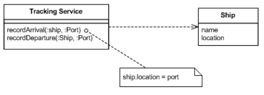

# Event Sourcing
Event Sourcing ensures that all changes to application state are stored as a sequence of events.
* We can query the events.
* Use the event logs to reconstruct past states
  * and as a foundation to automatically adjjust the state to cope with retroactive changes.

## How it works?
Fundamental idea

  * Ensuring every change to the state of an application is captured in an event object
  * These event objects are themselves stored in the sequence that were applied for the same lifetime as the application state itself.

For e.g. Shipping Notifications - we have many ships ont he high seas, and we need to know where they are
Simple way -> to have a tracking application with methods to allow us to tell when a ship  arrives or leaves a port.

* When the service is called, it finds the relevant ship and updates its location. The ship object records the current known state of the ships.

**Introducing Event Sourcing** add a step to the process.
Now the service creates an event object to record the change and processes it to update the ship.

**Differences**
* With the basic service we see just the final state captured by the ship objects. 
* With Event Sourcing, we capture each event. 
  * Essentially we are storing 2 things
    * application state
    * event logs

### Aspects
- The most obvious thing we've gained by using Event Sourcing is that we now have a log of all the changes.
    - Not just can we see where each ship is, we can where it' been.
- The key to Event Sourcing is that we gurantee that all changes to the domain objects are initiated by the event objects.
- It offers a number of facilities that can be built on top of the event log
  - **Complete Rebuild**
    - the stored state can be discarded, and it can be replicated by playing the events
  - **Temporal Query**
    - Application state can be determined at any point in time.
      - Essentially by creating a blank state, and playing all the events since inception.
  - **Event Replay**
    - If we find a past event was incorrect, we can compute the consequences by reversing it and later events and then replaying the new event and later events.
- One of the _**tricky elements of Event Sourcing**_ is how to deal with external systems that don't follow this approach (and most don't)
  - you get problems when you are sending modifier messages to external systems and when you are receiving queries from other systems.

### Examples
- Version control systems
- 

----------------------------------------------------------------------------------------------------------------------

## References:
* https://martinfowler.com/eaaDev/EventSourcing.html