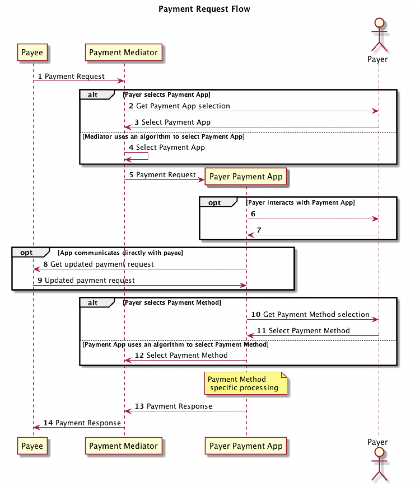

# Payment Processing System

----------------------------------------------------------------------------------------------------------------------

Key aspects to consider before designing a payment gateway?
* PCI DSS for Credit Card (CC) Processing, which stands for Payment Card Industry Data Security Standard that has 12 rules that enforce some level of security to protect Credit Card information, but can be applied for any Personal Identifiable Information. In order to process credit cards you may be subjected to PCI DSS Audit and certification, which may imply big costs or personal liabilities.
* Security and Encryption. This aspect is closely related to PCI DSS, which is enforces multiple processes into your software development process. However, you don’t have to process credit cards to worry about security, but security should be of a high stake for your team and every team member, because it is very hard to gain trust and super easy to get it lost.
* Geography. This is very important subject on which will depend the list of methods of payment you should accept, which localisations and cultures should be supported, where your servers should be and how fast they should perform.
* Traffic and Scalability. Software Requirements, as well as Payments Processing, differs depending on the scale of your system. If you do a few sales per day you can 100% outsource Payment Processing to a Payment Service Provider (aka Stripe), but if you must process millions or billions per year than your system architecture and amount of partners will differ, as a result, complexity will skyrocket comparably to the basic case.
* MCC codes Or the Industry you are in. Depending on the industry your business is in effect on your architecture can be dramatic, system design and legal implications. If you do Poker, Gambling or Adult (18+) payment processing you will see pretty big difference and risks comparably to a e-commerce shop, as well as required knowledge and legal restrictions and regulations.
* Backup payment processors. If you need to handle retries and backup Payment Service Providers you may be forced to have different architecture and security restrictions.
* Operations and customer support. Thinking about Payment architecture you should not forget about your Customer Happiness team as well as Fraud and Business analysts who need to consume and reconfigure system “during the flight”.
* Business acquisition and merges. If your business has parent-child relationships with other companies and they have built a payment processing platform that can be reused you can save a lot of time and money. From another side, if you a CTO of an umbrella company you may need to work on a processing system that may be a Gateway to other companies in the group.
* Cloud vs On-Premise. This point comes more like “To be or not to be” in the current days and before saying that cloud is not security or reliable I would advise to check this page. And reliability mostly depends on the Engineering that rules the system.
* Analytics. If you want to be profitable and improve over time you will have to have analytics that can influence system architecture dramatically to help your team answer many questions. Another important point here is the duration of your waiting period before you need your answers (minutes vs days) which may have difference between OLAP or Data Streaming approaches.
* Fraud (External or Internal). Yes, the fraud can be internal as well, so developing payment processing system you always need to think about internal and external breaches, data trading or similar issues. Here you can employ already standard rule-base systems and extend them with machine learning systems and manual ad-hoc reviews.
* Mobile. Whether you need to support Native Mobile Application or not, mobile may have addition architectural and deployment implications. For example, you have a native App, but you cannot control when the user will update it, so you may be forced to support a huge set of versions and API, but knowing this upfront may help you a lot. And don’t forget that in the AppStores you cannot use your Payment system to pay for In-App purchases (and you may not want this) which has 30% revenue share, but if you sell good or services which are consumed outside of an App you may willingly go for off-App Payment Processing, which brings additional complexity.

What can you do to improve you app/website payment gateway?
* Errors handling:
    * Extend your error library to cover all the potential outcomes
        * A customer need to know why his card is declined! Because there are insufficient funds, or because he is trying to pay with the wrong card?
        * Bank card could be declined because of several reasons:
            * 3d security,
            * insufficient funds, 
            * blocked by the bank, 
            * wrong information, 
            * a card is in the black list, 
            * payment limit, etc.
    * Give a proper description to an every error.
        * If there is a problem because customer’s bank allows to buy things without 3d security only under 50 euros — customer should know that.
    * Propose actions.
        * Link each error to a potential solution. It could be a button that will lead your customer to the support chat, or FAQ, or to the payment settings.
    * Most of the banks force to enter 3d security password(essentially multi factor authentication) when buying goods for the price above 50 or 100 euros.
    * For you as a business it means that you need to display/redirect/show a pop 3d security window when user is buying something from you that requires 3ds. Otherwise the payment will fail.
* Only essential information
    * Nowadays most of the information required to complete online purchase could be taken from user profile, geolocation, cellular network, browser history, etc.
    * The point here is that you can use technology to decrease the effort customer will put into filling all required information. Customer will spend less time and will make fewer errors, therefore there is a bigger chance that he will complete payment process.
    * All you really need to ask your customer is:
        * Card number
        * Card's holder name (you can fetch customer’s name from the profile, but I would recommend asking the name anyway because customer’s legal name might be written differently)
        * Expiration date
        * CVV
* Card Number
    * Good to show the card number in spaces, to help customer catch mistakes is if any at point in the transaction, where it is revokable.
    * 
* Progress Indicator
* Success State
* Show the customer that he has got his item

----------------------------------------------------------------------------------------------------------------------

##### Role Based Payment Processing Request Flow

----------------------------------------------------------------------------------------------------------------------
