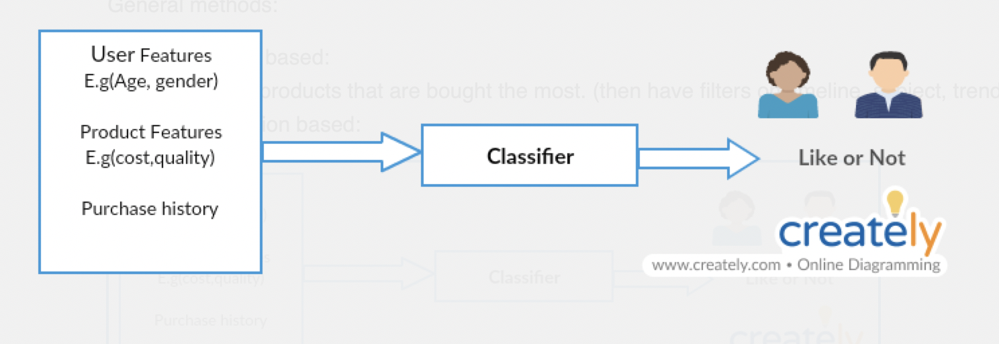
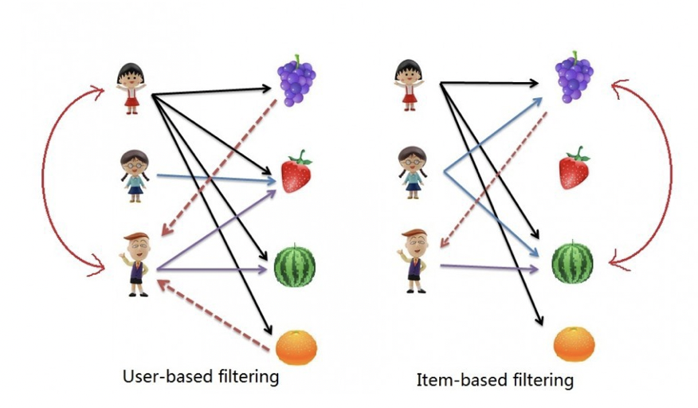

### Recommendations/Recommender system

----------------------------------------------------------------------------------------------------------------------

##### Requirements:
* Recommend products which customers might like or might want to buy.
* Achieve higher CTR (Click through rate)
* 

##### Ref: \[0]
###### Approach in general
* Aim to provide the most relevant and accurate items to the user by filtering useful stuff from a huge pool of information base.
* Discover data patterns in the data set by learning consumers choices and produced the outcomes that correlates to their needs and interests.
* ML is necessarily not the only solution - simpler and effective approaches exist.
    * For e.g. simply video recommendation system could be based on
        * suggesting videos from same author/publisher.
        * sort based on popularity, classification, collaborative filtering
        * nearest neighbour, matrix factorisation

##### General methods:
* **Popularity based:**
    * e.g. products that are bought the most. (then have filters on timeline, subject, trend, geo location etc.)
* **Classification based**:
    
    * In the above diagram, based on features like Age, gender and product features like cost, quality and product history, based on their input our classifier will give a binary value user may like or not, based on that boolean we could recommend product to a customer.
* **Collaborative filtering**
    * Primarily based on assumption that people like things similar to other things they like, and things that are liked by other people with similar taste.
    * Collaborative filtering model types:
        * Nearest neighbour collaborative filtering
            * used to find out either similar users or similar products
            * 2 ways: User based & Item based
                
* So, say, Item A and B were purchased by both users X and Y then both are similar.
* User based: find users who have similar taste of products as the current user, similarity is based on purchasing behavior of the user.
* Item based: So, the system would recommend items that are similar to the item user bought, similarity based on co-occurrence of purchases. For e.g. someone who has bought Nike jacket, would be recommended other popular variants of Nike jackets.
* Matrix factorisation collaborative filtering (Ref [1])
    * Idea is to factorize a matrix, to find out >=2 matrices such that when you multiply them you will get back the original matrix.
    * **[Given factorisation with items and users] users would have rated some items in the system -> we need to predict how the users would rate the items that they have not yet rated, such that we can make recommendations to the users.**
    * Assume now we have 5 users and 10 items, and ratings are integers ranging from 1 to 5, the matrix may look something like this (a hyphen means that the user has not yet rated the movie)
        * 

* The task of predicting the missing ratings can be considered as filling in the blanks (hyphens) such that the values be consistent with the existing ratings in the matrix.
* The matrix would be sparse, since not everyone would be watching all the movies.
* For e.g. 2 users would give high ratings to a certain movie is they both like the actors/actresses of the movie, or is the movie is an action movie, which is a genre preferred by both users. Hence, is we can discover these latent features, we should be able to predict a rating with respect to a certain user and a certain item, because the features associated with the user should match with the features associated with the item.

##### General examples:
* Amazon
* Netflix

----------------------------------------------------------------------------------------------------------------------

##### References:
[0]: https://medium.com/@madasamy/introduction-to-recommendation-systems-and-how-to-design-recommendation-system-that-resembling-the-9ac167e30e95
[1]: http://www.quuxlabs.com/blog/2010/09/matrix-factorization-a-simple-tutorial-and-implementation-in-python/
[2] : Recommendations Feature on drive: https://docs.google.com/document/d/19FKoBk92KJPVjOJRp35lRJYjU81Z0IArRRtKMQyO-yI/edit