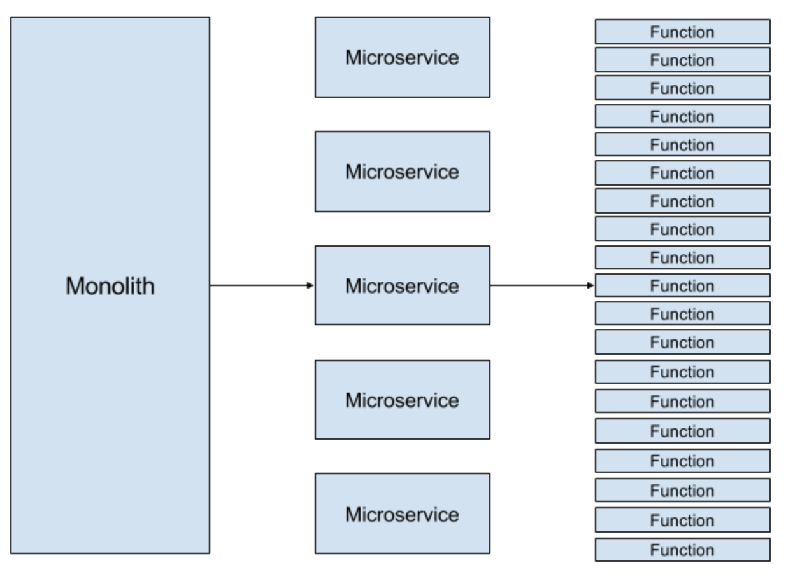
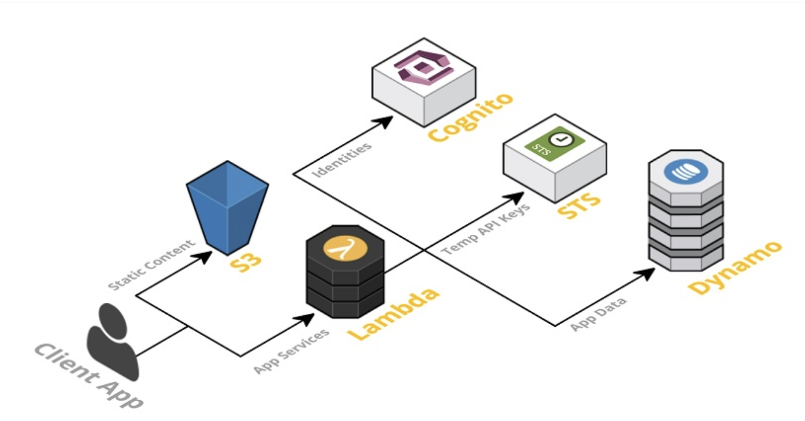

#  Serverless - Function as a Service
  
  
----------------------------------------------------------------------------------------------------------------------
  
#####  Serverless Architecture
  
* **Serverless architectures** refer to applications that significantly
  * > is defined by stateless compute containers and modeled for an event-driven solution 
  * depend on third-party services (knows as Backend as a Service or “BaaS”) 
  * or on custom code that’s run in ephemeral containers (Function as a Service or “FaaS”), the best known vendor host of which currently is AWS Lambda.
  
* Does not actually mean "server" "less" - it very well runs on server (having itself being deployed)
  
* The name *“serverless computing”* is used because the business or person that owns the system **does not have to purchase, rent or provision servers or virtual machines for the back-end code to run on**.
  

  
  
----------------------------------------------------------------------------------------------------------------------
  
#####  Going beyong PAAS and containers
  
* Serverless computing or FaaS completely alleviates the shortcomings of PaaS model. PaaS has operational concerns of scaling and friction between development and operations.
  
* Services like AWS Lambda, Google’s Cloud Functions or Azure Functions allow developers to write just the request processing logic in a function. And other aspects of architecture such as middleware, bootstrapping and scaling are automatically handled.
  
* **Serverless computing can disrupt is containerization.**
  
  
  
  
----------------------------------------------------------------------------------------------------------------------
  
####  Framework of a Serverless Architecture
  
* ##### Client Application – 
  * The UI of your application is best-rendered client side in Javascript which allows you to use a simple, static web server.
  
* ##### Web Server – 
  * Amazon S3 provides a robust and simple web server. All of the static HTML, CSS and js files for your application can be served from S3.
  
* ##### FaaS solution – 
  * It is the key enabler in serverless architecture. Some popular examples of FaaS are AWS Lambda, Google Cloud Functions, and Microsoft Azure Functions. AWS Lambda is used in this framework. The application services for logging in and accessing data will be built as Lambda functions. These functions will read and write from your database and provide JSON responses.
  
* ##### Security Token Service (STS)
  * will generate temporary AWS credentials (API key and secret key) for users of the application. These temporary credentials are used by the client application to invoke the AWS API (and thus invoke Lambda).
  
* ##### User Authentication – 
  * AWS Cognito is an identity service which is integrated with AWS Lambda. With Amazon Cognito, you can easily add user sign-up and sign-in to your mobile and web apps. It also has the options to authenticate users through social identity providers such as Facebook, Twitter, or Amazon, with SAML identity solutions, or by using your own identity system.
  
* ##### Database – 
  * AWS DynamoDB provides a fully managed NoSQL database. DynamoDB is not essential for a serverless application but is used as an example here.
  

  
----------------------------------------------------------------------------------------------------------------------
  
#####  Benefits of Serverless Architecture
  
  
1. **Easier operational management**
    * The serverless platform provides a clear separation between infrastructure services and applications running on top of the platform.
    * Automatic scaling functionality of FaaS not only reduces compute cost but also reduces operational management overheads.
    * System Engineers and SREs can focus on managing and running the underlying platform and core services such as databases and load balancers while product engineers manage the functions running on top of the platform.
    * >*In purist terms, a serverless system won’t require continuous integration, continuous delivery or containerization tool. Developers can write the code directly in the vendor console. Thus a fully serverless solution will require zero system administration.*

2. **Faster innovation**
   * Product engineers can innovate at a rapid pace as serverless architecture has alleviated the problems of system engineering in the underlying platform. 
     * Thus less time for operations translates into a smooth application of DevOps and agile methodologies. 
   * Regular concerns of an internet facing application like identity management, storage, etc are exposed to FaaS or handled by the underlying middleware. 
   * Product engineers can concentrate on developing the actual business logic of the application. 
  
3. **Reduced operational costs**
   * Similar to IaaS and PaaS, infrastructure and human resource cost reduction is the basic advantage of the serverless architecture. 
   * In the serverless solution, you pay for managed servers, databases and application logic. 
     * AWS Lambda bills you only for the time when the function is called. 
       * As a result, the cost of running FaaS Lambda functions can be 95% less than running a server for the entire month with the container on it. 
     * Now services that were renting servers in AWS costing thousands of dollars have reduced to less than $10. The savings can be incredible. 
   * The basic advantage of this technology is that **you only pay for the time your function executes and the resources it needs to execute.**
  
  
----------------------------------------------------------------------------------------------------------------------
  
#####  Drawbacks of Serverless computing/architecture
  
1. **Problems due to third-party API system**
   * Vendor control, multitenancy problems, vendor lock-in and security concerns are some of the problems due to the use of 3rd party APIs.
   * Giving up system control while implementing APIs can lead to system downtime, forced API upgrades, loss of functionality, unexpected limits and cost changes.
  
  
2. **Lack of operational tools**
    * The developers are dependent on vendors for debugging and monitoring tools. 
    * Debugging Distributed Systems is difficult and usually requires access to a significant amount of relevant metrics to identify the root cause.
  
  
3. **Architectural complexity**
    * Decisions about how small (granular) the function should be, takes time to assess, implement and test. 
    * There should be a balance between the number of functions should an application call.
  
4. **Implementing drawbacks** 
   * Integration testing Serverless Apps is tough. 
   * The units of integration with **Serverless FaaS** (i.e. each function) are a lot smaller than with other architectures and therefore we rely on integration testing a lot more than we may do with other architectural styles. 
   * **Problems** related to **deployment**, **versioning** and **packaging** also exist. 
     * You may need to deploy a FaaS artifact separately for every function in your entire logical application. 
     * It also means you can’t atomically deploy a group of functions and t**here’s no concept of versioned applications so atomic rollback isn’t an option**. 
     * You may need to turn off whatever **event source** is triggering the functions, deploy the whole group, and then turn the event source back on.
  
  
  
  
----------------------------------------------------------------------------------------------------------------------
####  References:
  
* https://medium.com/@MarutiTech/what-is-serverless-architecture-what-are-its-criticisms-and-drawbacks-928659f9899a
* https://aws.amazon.com/serverless/
* https://medium.com/openwhisk/uncovering-the-magic-how-serverless-platforms-really-work-3cb127b05f71
* Good one: https://marutitech.com/serverless-architecture-business-computing/?source=post_page-----928659f9899a----------------------
  