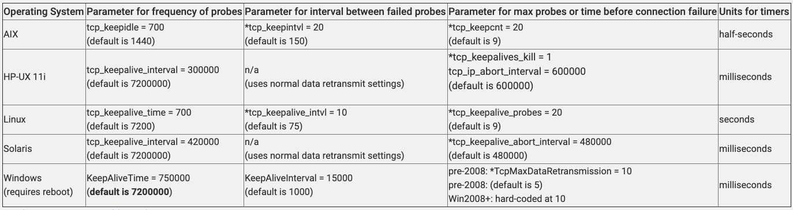

# RFC 1122
* https://tools.ietf.org/html/rfc1122#page-101
  * Keep-alive packets MUST only be sent when no data or acknowledgement packets have been received for the connection within an interval.  
    * **This interval MUST be configurable and MUST default to no less than two hours.**

# HTTP Persistent Connections & TCP Keep Alives
* ## TCP Keep Alive: 
* IMP/DETAILED: <https://stackoverflow.com/a/33927447/1592801>

# Keep Alive Process
* There are three configurable properties that determine how Keep-Alives work. On Linux they are:
  * tcp_keepalive_time
      * default 7200 seconds
  * tcp_keepalive_probes
      * default 9
  * tcp_keepalive_intvl
      * default 75 seconds
* Process:
  1. Client opens TCP connection
  2. If the connection is silent for `tcp_keepalive_time` seconds, send a single empty ACK packet.
     1. Did the server respond with a corresponding ACK of its own?
        1. **No**
           1. Wait tcp_keepalive_intvl seconds, then send another ACK
           2. Repeat until the number of ACK probes that have been sent equals tcp_keepalive_probes.
           3. If no response has been received at this point, send a RST and terminate the connection.
        2. **Yes**: Return to step 2 (not 2.1.1.2)
 * This process is enabled by default on most operating systems, and thus dead TCP connections are regularly pruned once the other end has been unresponsive for** 2 hours 11 minutes 
     * (7200 seconds + 75 s * 9 times)**.

# Changing TCP timeouts
* **Reducing `tcp_keep_alive_time` from 7200 s**: There are cases when this has been reduced, since bandwidth has become cheaper
  * <https://stackoverflow.com/a/33927447/1592801>
* **Reducing `tcp_keep_alive_time` from 7200 s**: 
    * ## Examples where TCP Keep alive has been reduced from 2 hours/7200 s
      * <https://www.veritas.com/support/en_US/article.100028680>
        * 
      * <https://knowledge.broadcom.com/external/article/142410/tuning-tcp-keepalive-for-inprogress-task.html>
        * from 7200 s -> 600 s
* ## Per Socket
  * TCP connections are managed on the OS level, Java does not support configuring timeouts on a per-socket level such as in `java.net.Socket`
  * ### SO_KEEPALIVE
    *  Looking at the official documentation: https://docs.oracle.com/en/java/javase/11/docs/api/java.base/java/net/SocketOptions.html#SO_KEEPALIVE
       * Crucial points:
           * This option enables periodic probing of the connection to ensure that the peer is still present.
           * Quoting from official doc: The purpose of this option is to detect if the peer host crashes. Valid only for TCP socket: SocketImpl
           * Apparently, seems to abide by(and not override to send) the OS TCP Keep Alive time setting.
  * Also, not sure, how far the use of JNI to create Java Sockets that call the native code to configure these options are beneficial. Following examples, quoted - <https://stackoverflow.com/a/33927447/1592801>, don't seem to have widespread community adoption or support
      * <https://github.com/lucwillems/JavaLinuxNet>
      * <https://github.com/flonatel/libdontdie>

# curl - keep alive behavior
* `CURLOPT_TCP_KEEPIDLE` - set TCP keep-alive idle time wait
  * Description:
    * Pass a long. Sets the delay, in seconds, that the operating system will wait while the connection is idle before sending keepalive probes. Not all operating systems support this option.
    * From: <https://manpages.debian.org/testing/libcurl4-doc/CURLOPT_TCP_KEEPIDLE.3.en.html>

# Problems with a very high idle keepAliveTime
* it may cause a delay before the machine at one end of the connection detects that the remote machine is no longer available.
    * If the application can handle reconnect scenario, it will take a very long time until it notices the connection is dead and it would have been able to handle it properly if it failed fast.
* many firewalls drop the session if no traffic occurs for a given amount of time.
* Quoting from <https://benohead.com/blog/2014/07/30/windows-network-connections-timing-quickly-temporary-connectivity-loss/#KeepAliveTime>
  * If you encounter one of these cases on a regular basis, you should consider reducing the KeepAliveTime from 2 hours to 10 or 15 minutes (i.e. 600,000 or 900,000 milliseconds).

# Problems with lower keepAliveTime
* increases network activity on idle connections
* can cause active working connections to terminate because of latency issues.
