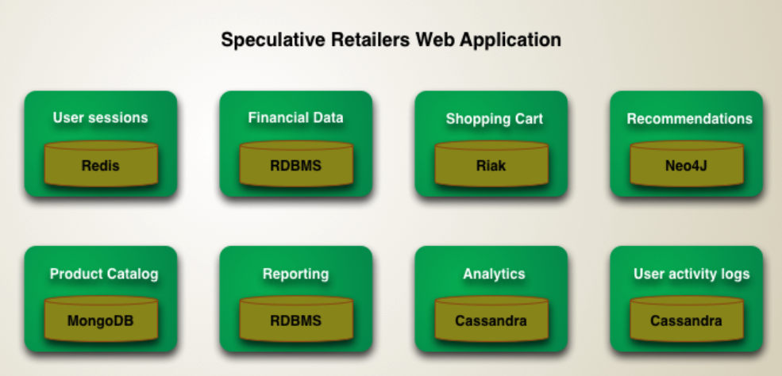
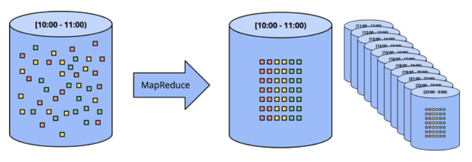

# Web Application & Software Architecture

# Web Architecture
* ## REST API (vs SOAP concepts)

* ## HTTP - Push Pull

* ## HTTP - Push based technologies

* ## HTTP/2

* ## HTTP/3

# DB
* ## Polyglot persistence
    * Have a variety of different data storage technologies for different kinds of data.
    * Eg
        * 
    * 

* ## Eventual Consistency

* ## Document oriented DB

* ## Graph based DB

* ## CAP theorem

* ## Time series DB

# Caching
* ## Caching Strategies

# Message queues
* ## Pub Sub Model

* ## Point to Point Model

* ## Notification Systems & Real-time Feeds with Message Queues

* ## Handling Concurrent Requests With Message Queues

# Stream Processing
  * To query continuous data stream and detect conditions, quickly, within a small time period from the time of receiving the data. 
  * Its a Big Data technology.
  * Check your own note - Questioning the Lamdba Architecture.md (also has notes on "The LOG" crucial element of all sophisticated Distributed services)
* ## Why do we need stream processing?
    * Some data comes naturally as a continuous never ending stream of events
    * Batch processing (compaction of activity kind of)
    * Sometimes data is huge and it is not even possible to store it.
* ## Responsibilities of an Event Stream Processor 
    * (Data can either be sent directly to the stream processor, have it sent to the broker and the processor essentially a listener will get the data "continuously")
    * Collect data (from a source)
    * deliver to each designated/registered actor
    * ensure ordering (more nuances and exceptions exist)
    * collecting results (from listeners)
    * scaling if the load is high
    * Handling failures
* ## Data Processing Patterns
    * **Bounded data**
        * A finite pool of unstructured data on the left is run through a data processing engine, resulting in corresponding structured data on the right.
        * 
    * **Unbounded data - Batch**
        * As the name suggests
        * At times, also work with an infinite stream of data
    * **Fixed windows**
        * In reality, however, most systems still have a completeness problem to deal with 
            * (What if some of your events are delayed en route to the logs due to a network partition? 
            * What if your events are collected globally and must be transferred to a common location before processing? 
            * What if your events come from mobile devices?), which means **some sort of mitigation might be necessary** (e.g.,** delaying processing until you’re sure all events have been collected or reprocessing the entire batch for a given window whenever data arrive late**).
        * 
* ## Data Ingestion

* ## Different ways of ingesting data and the challenges involved

* ## Data Ingestion use cases

* ## Data Pipelines

* ## Distributed Data Processing

* ## Lambda Architecture

* ## Kappa Architecture

# General Architure
* ## Event driven

* ## Web Hooks

* ## Shared nothing

* ## Hexagonal Architecture

* ## Peer to Peer Architecture

* ## Decentralized social networks

* ## Federated Architecture

# Security

# Case study - A web based mapping service like Google Maps

# Case Study - A Baseball Game Ticket Booking Web Portal

# References:
* Course on educative.io - <https://www.educative.io/courses/web-application-software-architecture-101?affiliate_id=5073518643380224>